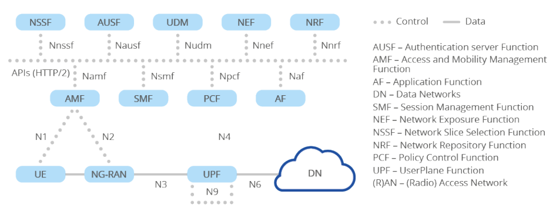
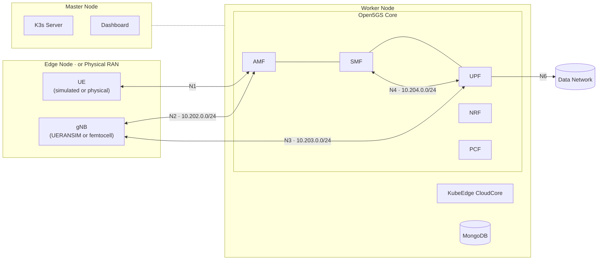

<p align="center">
  
</p>

# KELT

**Kubernetes-Edge Lightweight Testbed**: a lightweight, reproducible, cloud-native 5G core and cloud-edge testbed that runs on a single workstation. It deploys a 3-node virtual cluster (K3s master, 5G core worker, optional KubeEdge edge) connected by isolated VXLAN overlays and operated through a unified operations dashboard.

[](LICENSE)

## Status

A research testbed under active development. Components are tiered by maturity:

- **Supported** (validated, reproducible): core 5G deployment, VXLAN overlays, dashboard, IAM, node and NF metrics, physical RAN, CAMARA location and positioning.
- **Experimental** (present, not fully validated): UERANSIM, KubeEdge edge node, UPF-MEC, log and alerting stack.
- **Planned** (no working code yet): edge provisioning from the dashboard, MEC scheduling, O-RAN RIC, NWDAF.

Full matrix and reproducibility scope: [docs/status.md](docs/status.md).

## How It Works

Three virtual machines form the cluster. The worker runs the Open5GS core network functions (AMF, SMF, UPF, NRF, and others) alongside KubeEdge CloudCore. The edge node hosts EdgeCore with UERANSIM gNB and UEs, or a physical femtocell. OVS+VXLAN tunnels carry the 5G control and user-plane traffic between them with per-interface isolation.

### 5G System Architecture (3GPP Release 17)



The testbed implements the reference point interfaces: N1 (UE–AMF), N2 (gNB–AMF), N3 (gNB–UPF), N4 (SMF–UPF), and N6 (UPF–DN). Each interface runs on a dedicated VXLAN-isolated overlay.

### Testbed Implementation



## Getting Started

**Host OS:** Ubuntu 24.04.4 LTS (desktop and server). Other Linux distributions are untested.

**Prerequisites:** Vagrant ≥ 2.3.0, VirtualBox ≥ 6.1.0, 16 GB RAM. The first-run wizard checks these and offers to install [gum](https://github.com/charmbracelet/gum) and the shell alias automatically.

```bash
git clone https://github.com/Jacobbista/kelt.git
cd kelt
./testbed-config           # first run launches the onboarding wizard
```

The wizard verifies host requirements (vagrant, VirtualBox, vboxusers
group, CPU virtualization), installs gum, sets up the `testbed`
shell alias, and initializes the deployment profile. Once complete,
the alias works from any directory:

```bash
testbed up                 # bring the cluster up
testbed                    # open the interactive menu
testbed autostart on       # bring the cluster up automatically on boot
testbed help               # full reference
```

**Verify after deployment:**
```bash
vagrant ssh master
sudo k3s kubectl get nodes
sudo k3s kubectl get pods -n 5g
```

**Full guides:**
- End-user and agent operations: [QUICKSTART.md](QUICKSTART.md)
- Detailed walkthrough: [docs/getting-started.md](docs/getting-started.md)
- Tool reference: [docs/tools/testbed-config.md](docs/tools/testbed-config.md)

## Stack

VMs run Ubuntu 22.04 (Jammy).

| Layer | Technology | Version |
|-------|------------|---------|
| Container orchestration | K3s | v1.30.6+k3s1 |
| Edge computing | KubeEdge | 1.21.0 |
| 5G core | Open5GS | 2.7.7 (patched; per-NF images built in [5g-nf-platform](https://github.com/Jacobbista/5g-nf-platform)) |
| RAN simulation | UERANSIM | 3.2.7 ([jacobbista/comnetsemu-ueransim](https://hub.docker.com/r/jacobbista/comnetsemu-ueransim)) |
| Overlay networking | OVS + VXLAN | OVS CNI 0.34.3 |
| Multi-homed pods | Multus CNI | 4.1.0 |
| IPAM | Whereabouts | 0.7.0 |
| Operations | Dashboard (FastAPI + React) | |

## 5G Interfaces

| Interface | Subnet | Protocol | Path |
|-----------|--------|----------|------|
| N1 | 10.201.0.0/24 | NAS / SCTP | UE ↔ AMF |
| N2 | 10.202.0.0/24 | NGAP / SCTP | gNB ↔ AMF |
| N3 | 10.203.0.0/24 | GTP-U / UDP | gNB ↔ UPF |
| N4 | 10.204.0.0/24 | PFCP / UDP | SMF ↔ UPF |
| N6c | 10.207.0.0/24 | IP / NAT | UPF-Cloud ↔ internet |
| N6m | 10.208.0.0/24 | IP routing | UPF-Cloud ↔ MEC data network |
| N6e | 10.206.0.0/24 | IP routing | UPF-Edge ↔ MEC (disabled) |

## Testing

```bash
cd tests
make e2e        # End-to-end: UE registration, PDU session, data plane
make protocols  # Protocol validation: NGAP, PFCP, GTP-U
make ran        # Physical RAN: dongle enumeration and connectivity
```

## Documentation

Full documentation lives in [docs/](docs/README.md).

**Architecture**
- [System Overview](docs/architecture/overview.md) — node roles, component placement, deployment flow
- [Virtualization Layers](docs/architecture/virtualization-layers.md) — 5-layer stack from host to 5G NFs
- [Network Topology](docs/architecture/network-topology.md) — OVS, VXLAN, Multus from first principles
- [5G Interfaces](docs/architecture/5g-interfaces.md) — N1–N6 subnets, IPs, ports, verification

**Deployment**
- [Deployment Phases](docs/deployment/phases.md) — what each of the 12 phases does
- [Server / NUC Setup](docs/deployment/server-setup.md) — headless server deployment
- [Physical RAN Integration](docs/deployment/physical-ran.md) — connect a real femtocell

**Operations**
- [Troubleshooting](docs/operations/troubleshooting.md) — start here when something is wrong
- [Handbook](docs/operations/handbook.md) — operator cheat-sheet (IPs, ports, commands)
- [Runbooks](docs/runbooks/) — step-by-step diagnostics for NGAP, PFCP, GTP-U, OVS, Multus

**Dashboard**
- [Overview](docs/dashboard/overview.md) — architecture, access URLs, security model
- [API Reference](docs/dashboard/api-reference.md) — REST and WebSocket endpoints

## Companion Repositories

KELT pulls container images built and versioned in separate repositories:

- [**5g-nf-platform**](https://github.com/Jacobbista/5g-nf-platform) — per-NF Open5GS images (AMF, SMF, UPF, and the rest) with research patches, built and published via CI. Pinned by tag in `ansible/group_vars/all.yml`.
- [**5g-northbound**](https://github.com/Jacobbista/5g-northbound) — CAMARA gateway and positioning engine / demo images for the optional northbound addons.

The `5g-probe` UE measurement tool ships in this repository under [`5g-probe/`](5g-probe/).

## License

Copyright 2024–2026 Jacopo Bennati. Licensed under the [Apache License 2.0](LICENSE).

Third-party component licenses are listed in [NOTICE](NOTICE).

## Acknowledgements

Inspired by [ComNetsEmu](https://www.granelli-lab.org/researches/relevant-projects/comnetsemu-sdn-nfv-emulator), the SDN/NFV network emulator from the [Granelli Lab](https://www.granelli-lab.org) (Prof. Fabrizio Granelli, University of Trento), where this project started as a course project. KELT takes a different route: it runs real workloads on Kubernetes connected by real OVS/VXLAN overlays, rather than ComNetsEmu's Mininet and Docker emulation.

Built with [K3s](https://k3s.io), [KubeEdge](https://kubeedge.io), [Open5GS](https://open5gs.org), [UERANSIM](https://github.com/aligungr/UERANSIM), and [Multus CNI](https://github.com/k8snetworkplumbingwg/multus-cni).
