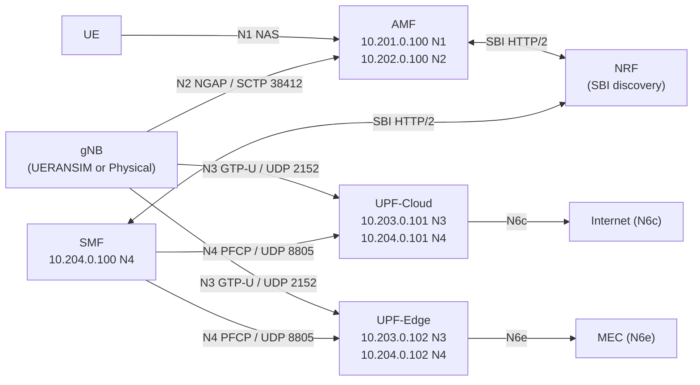

# 5G Network Interfaces

This document is the reference for all 5G N-reference-points implemented in the testbed: subnets, static IPs, protocols, OVS bridges, and VXLAN keys. Read [Network Topology](network-topology.md) first for how the OVS/Multus layer works.

> **kubectl**: All verification commands run from master using `sudo k3s kubectl`.

## Interface Map



---

## N1: UE ↔ AMF (NAS)

| Property | Value |
|----------|-------|
| Purpose | Non-Access Stratum signaling (registration, authentication, PDU session) |
| Protocol | NAS over SCTP |
| Subnet | 10.201.0.0/24 |
| Gateway | 10.201.0.1 |
| AMF static IP | 10.201.0.100 |
| OVS bridge | br-n1 |
| VXLAN VNI | 101 |
| NAD | `5g/n1-net` |

**IPAM note**: `n1-net` excludes `10.201.0.100/32` from the Whereabouts dynamic range so AMF's static IP is never reassigned.

**Verification**:
```bash
sudo k3s kubectl -n 5g exec deploy/amf -- ip -o -4 addr show dev n1
# Expected: 10.201.0.100
sudo k3s kubectl -n 5g get net-attach-def n1-net
```

---

## N2: gNB ↔ AMF (NGAP)

| Property | Value |
|----------|-------|
| Purpose | NG Application Protocol — RAN control plane |
| Protocol | NGAP over SCTP |
| Port | 38412 |
| Subnet | 10.202.0.0/24 |
| Gateway | 10.202.0.1 |
| AMF static IP | 10.202.0.100 |
| OVS bridge | br-n2 |
| VXLAN VNI | 102 |
| NAD | `5g/n2-net` |

**Key messages**: NG Setup, Initial UE Message, PDU Session Resource Setup, Handover.

**Physical RAN note**: when a physical gNB is connected via `br-ran`, the AMF also gets a secondary IP on the RAN subnet (`192.168.6.150`) via an additional Multus interface (`n2phy`). See [Physical RAN Integration](../deployment/physical-ran.md).

**Verification**:
```bash
sudo k3s kubectl -n 5g exec deploy/amf -- ss -Slnp | grep 38412
sudo k3s kubectl -n 5g exec deploy/amf -- ip -o -4 addr show dev n2
# Expected: 10.202.0.100
```

---

## N3: gNB ↔ UPF (GTP-U)

| Property | Value |
|----------|-------|
| Purpose | User plane data — GTP-U encapsulated IP packets |
| Protocol | GTP-U over UDP |
| Port | 2152 |
| Subnet | 10.203.0.0/24 |
| Gateway | 10.203.0.1 |
| UPF-Edge static IP | 10.203.0.102 |
| UPF-Cloud static IP | 10.203.0.101 |
| OVS bridge | br-n3 |
| VXLAN VNI | 103 |
| NAD | `5g/n3-net` |

**Traffic**: IP packets from the UE are encapsulated in GTP-U tunnels by the gNB and sent to the UPF. The UPF decapsulates them and forwards to the data network via N6.

**UPF-Edge note**: UPF-Edge is currently deployed with `replicas: 0` due to a CNI route conflict on the edge node. See [known-issues/upf-edge-cni-route-conflict.md](../known-issues/upf-edge-cni-route-conflict.md). UPF-Cloud handles all user-plane traffic until this is resolved.

**Physical RAN note**: when `PHYSICAL_RAN_SUBNET` is set, UPF-Cloud gets a return route (`192.168.6.0/24 via 10.203.0.254`) so GTP-U downlink packets find their way back through the worker's `br-n3` secondary IP to `br-ran` and out to the physical gNB.

**Verification**:
```bash
sudo k3s kubectl -n 5g exec deploy/upf-cloud -- ss -ulnp | grep 2152
sudo k3s kubectl -n 5g exec deploy/upf-cloud -- ip -o -4 addr show dev n3
# Expected: 10.203.0.101
```

---

## N4: SMF ↔ UPF (PFCP)

| Property | Value |
|----------|-------|
| Purpose | Packet Forwarding Control Protocol — session management |
| Protocol | PFCP over UDP |
| Port | 8805 |
| Subnet | 10.204.0.0/24 |
| Gateway | 10.204.0.1 |
| SMF static IP | 10.204.0.100 |
| UPF-Cloud static IP | 10.204.0.101 |
| UPF-Edge static IP | 10.204.0.102 |
| OVS bridge | br-n4 |
| VXLAN VNI | 104 |
| NAD | `5g/n4-net` |

**Key messages**: Session Establishment Request/Response, Session Modification, Session Deletion.

**Flow**: When a UE requests a PDU session, AMF triggers SMF via SBI. SMF then sends a PFCP Session Establishment to UPF, which installs the forwarding rules (match on TEID, forward to N6). SMF returns the tunnel parameters (UPF TEID, N3 IP) to AMF for signalling back to gNB.

**Verification**:
```bash
sudo k3s kubectl -n 5g exec deploy/smf -- ss -ulnp | grep 8805
sudo k3s kubectl -n 5g exec deploy/smf -- ip -o -4 addr show dev n4
# Expected: 10.204.0.100
```

---

## N6: UPF ↔ Data Network

| Property | Value |
|----------|-------|
| Purpose | Connection to external data network (internet or MEC) |
| Protocol | IP routing + NAT |
| N6c subnet | 10.207.0.0/24 — UPF-Cloud → internet |
| N6m subnet | 10.208.0.0/24 — UPF-Cloud → MEC data network |
| N6e subnet | 10.206.0.0/24 — UPF-Edge → MEC (disabled) |
| OVS bridges | br-n6c (VNI 107), br-n6m (VNI 108), br-n6e (VNI 106) |
| NADs | `5g/n6-cld-net`, `mec/n6m-net`, `mec/n6-mec-net` |

**Naming convention**: `N6c` / `N6m` / `N6e` are testbed-local labels for distinct N6 data-network instances, not standardized 3GPP interfaces. In 3GPP, N6 is the reference point between the UPF and a data network, and a deployment can have several. The suffixes distinguish the three data networks this testbed attaches: consumer internet breakout (`c`), the MEC application network at the central UPF (`m`), and the edge-local breakout at the edge UPF (`e`).

**N6c (internet breakout via UPF-Cloud)**: The worker VM has `ip_forward` enabled and `iptables MASQUERADE` rules for the `10.207.0.0/24` subnet. Traffic exiting UPF-Cloud on the N6c interface is NAT'd to the worker's `eth0` (NAT NIC) and forwarded to the internet.

**N6m (MEC application network via UPF-Cloud)**: A second N6 interface on UPF-Cloud connecting to a dedicated data network (`10.208.0.0/24`) that hosts the testbed's MEC application workloads. It is where edge-style application services are deployed and reached today, served by the central (cloud) UPF.

**N6e (edge-local MEC breakout via UPF-Edge)**: The same role anchored at the edge UPF instead of the central one, reserved for MEC applications co-located on the edge node. Currently inactive because UPF-Edge is disabled. See [known-issues/upf-edge-cni-route-conflict.md](../known-issues/upf-edge-cni-route-conflict.md).

**On "MEC" and locality**: MEC is defined by function (local application hosting with local breakout), not by which UPF serves it, so the N6m data network is the testbed's MEC network even though it is anchored at the cloud UPF. On a single workstation there is no physical distance, so "cloud" and "edge" are logical roles rather than latency tiers. A real latency difference appears only when application workloads run on the edge VM via KubeEdge, where link latency can be injected, or when the nodes are physically separated.

---

## SBI: Service-Based Interface

| Property | Value |
|----------|-------|
| Purpose | Inter-NF communication (discovery, auth, session control) |
| Protocol | HTTP/2 (no TLS in testbed) |
| Discovery | NRF — all NFs register and query via NRF |
| Transport | Flannel ClusterIP services (standard K8s networking) |

NFs using SBI: NRF, AMF, SMF, UDM, UDR, AUSF, PCF, BSF, NSSF.

**SBI does not use OVS overlays.** It runs over the standard Flannel network (`eth0`) via Kubernetes ClusterIP Services. This means it is only accessible from the worker node. Edge pods (gNB, UEs) cannot reach SBI directly; they communicate only via N1/N2/N3.

---

## Static IP Assignment Reference

All static IPs are defined in `ansible/group_vars/all.yml` and excluded from Whereabouts dynamic allocation:

| Component | N1 | N2 | N3 | N4 | N6c | N6m | N6e |
|-----------|-----|-----|-----|-----|-----|-----|-----|
| AMF | 10.201.0.100 | 10.202.0.100 | — | — | — | — | — |
| SMF | — | — | — | 10.204.0.100 | — | — | — |
| UPF-Cloud | — | — | 10.203.0.101 | 10.204.0.101 | 10.207.0.101 | 10.208.0.101 | — |
| UPF-Edge | — | — | 10.203.0.102 | 10.204.0.102 | — | — | 10.206.0.100 |

---

## Per-Cell Network Configuration

For multi-gNB deployments, each cell has its own dedicated N2/N3 subnet and VXLAN tunnel:

| Cell | N2 Subnet | N3 Subnet | VNI N2 | VNI N3 |
|------|-----------|-----------|--------|--------|
| Cell 1 | 10.202.1.0/24 | 10.203.1.0/24 | 1021 | 1031 |
| Cell 2 | 10.202.2.0/24 | 10.203.2.0/24 | 1022 | 1032 |
| Cell N | 10.202.N.0/24 | 10.203.N.0/24 | 102N | 103N |

Driven by `ansible/phases/06-ueransim-mec/vars/topology.yml`.

---

## Related Documentation

- [Network Topology](network-topology.md): OVS, VXLAN, Multus, and NAD configuration
- [Physical RAN Integration](../deployment/physical-ran.md): physical gNB connectivity and routing
- [Runbook: NGAP Diagnostics](../runbooks/ngap-diagnostics.md): N2 troubleshooting
- [Runbook: PFCP Diagnostics](../runbooks/pfcp-diagnostics.md): N4 troubleshooting
- [Runbook: GTP-U Path](../runbooks/gtpu-path.md): N3 troubleshooting
- [Operations Handbook](../operations/handbook.md): canonical IP reference with validation commands
