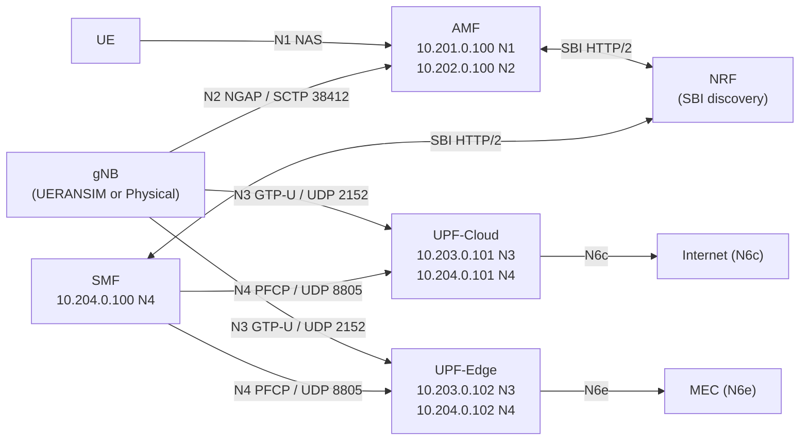

# 5G Network Interfaces

This document is the reference for all 5G N-reference-points implemented in the testbed: subnets, static IPs, protocols, OVS bridges, and VXLAN keys. Read [Network Topology](network-topology.md) first for how the OVS/Multus layer works.

Every address and VNI below is declared once, in the **5G network plan** block of `ansible/group_vars/all.yml`: per plane `<plane>_subnet`, `<plane>_gateway`, `<plane>_pool_start`/`_pool_end` and `<plane>_vni`, then the fixed endpoints and the UE pools. The overlay NADs, the OVS bridges, the UPF init scripts, the Open5GS configs, the Vagrantfile and the dashboard all read it from there; the values in this document explain the plan and are not a second source. Which planes may cross, and where, is in [Plane Isolation](plane-isolation.md).

> **kubectl**: All verification commands run from master using `sudo k3s kubectl`.

## Interface Map


```mermaid
graph LR
    UE["UE"]
    GNB["gNB
    (UERANSIM or Physical)"]
    AMF["AMF
    10.201.0.100 N1
    10.202.0.100 N2"]
    SMF["SMF
    10.204.0.100 N4"]
    UPF_C["UPF-Cloud
    10.203.0.101 N3
    10.204.0.101 N4"]
    UPF_E["UPF-Edge
    10.203.0.102 N3
    10.204.0.102 N4"]
    DN_C["Internet (N6c)"]
    DN_E["MEC (N6e)"]
    NRF["NRF
    (SBI discovery)"]

    UE -->|"N1 NAS"| AMF
    GNB -->|"N2 NGAP / SCTP 38412"| AMF
    GNB -->|"N3 GTP-U / UDP 2152"| UPF_C
    GNB -->|"N3 GTP-U / UDP 2152"| UPF_E
    SMF -->|"N4 PFCP / UDP 8805"| UPF_C
    SMF -->|"N4 PFCP / UDP 8805"| UPF_E
    UPF_C -->|"N6c"| DN_C
    UPF_E -->|"N6e"| DN_E
    AMF <-->|"SBI HTTP/2"| NRF
    SMF <-->|"SBI HTTP/2"| NRF
```

---

## N1: UE ↔ AMF (NAS)

| Property | Value |
|----------|-------|
| Purpose | Non-Access Stratum signaling (registration, authentication, PDU session) |
| Protocol | NAS over SCTP |
| Subnet | 10.201.0.0/24 |
| Gateway | 10.201.0.1 |
| AMF static IP | 10.201.0.100 |
| OVS bridge | br-n1 |
| VXLAN VNI | 101 |
| NADs | `5g/n1-net` (pool), `5g/n1-static` (fixed endpoints) |

**IPAM note**: `n1-net` excludes `10.201.0.100/32` from the Whereabouts dynamic range so AMF's static IP is never reassigned.

**Verification**:
```bash
sudo k3s kubectl -n 5g exec deploy/amf -- ip -o -4 addr show dev n1
# Expected: 10.201.0.100
sudo k3s kubectl -n 5g get net-attach-def n1-net
```

---

## N2: gNB ↔ AMF (NGAP)

| Property | Value |
|----------|-------|
| Purpose | NG Application Protocol — RAN control plane |
| Protocol | NGAP over SCTP |
| Port | 38412 |
| Subnet | 10.202.0.0/24 |
| Gateway | 10.202.0.1 |
| AMF static IP | 10.202.0.100 |
| OVS bridge | br-n2 |
| VXLAN VNI | 102 |
| NADs | `5g/n2-net` (pool), `5g/n2-static` (fixed endpoints) |

**Key messages**: NG Setup, Initial UE Message, PDU Session Resource Setup, Handover.

**Physical RAN note**: when a physical gNB is connected via `br-ran`, the AMF also gets a secondary IP on the RAN subnet (`192.168.6.150`) via an additional Multus interface (`n2phy`). See [Physical RAN Integration](../deployment/physical-ran.md).

**Verification**:
```bash
sudo k3s kubectl -n 5g exec deploy/amf -- ss -Slnp | grep 38412
sudo k3s kubectl -n 5g exec deploy/amf -- ip -o -4 addr show dev n2
# Expected: 10.202.0.100
```

---

## N3: gNB ↔ UPF (GTP-U)

| Property | Value |
|----------|-------|
| Purpose | User plane data — GTP-U encapsulated IP packets |
| Protocol | GTP-U over UDP |
| Port | 2152 |
| Subnet | 10.203.0.0/24 |
| Gateway | 10.203.0.1 |
| UPF-Edge static IP | 10.203.0.102 |
| UPF-Cloud static IP | 10.203.0.101 |
| OVS bridge | br-n3 |
| VXLAN VNI | 103 |
| NADs | `5g/n3-net` (pool), `5g/n3-static` (fixed endpoints) |

**Traffic**: IP packets from the UE are encapsulated in GTP-U tunnels by the gNB and sent to the UPF. The UPF decapsulates them and forwards to the data network via N6.

**UPF-Edge note**: UPF-Edge is currently deployed with `replicas: 0` due to a CNI route conflict on the edge node. See [known-issues/upf-edge-cni-route-conflict.md](../known-issues/upf-edge-cni-route-conflict.md). UPF-Cloud handles all user-plane traffic until this is resolved.

**Physical RAN note**: a physical gNB sits on its own subnet (`physical_ran_subnet`), so UPF-Cloud gets a return route to it via the N3 gateway (`n3_gateway`); the worker then routes to `br-ran` and out to the gNB. Without the route, GTP-U downlink falls back to the UPF default route and crosses N6 instead of N3. `make ran` checks both the route and the wire (no GTP-U on any `br-n6*`).

**Verification**:
```bash
sudo k3s kubectl -n 5g exec deploy/upf-cloud -- ss -ulnp | grep 2152
sudo k3s kubectl -n 5g exec deploy/upf-cloud -- ip -o -4 addr show dev n3
# Expected: 10.203.0.101
```

---

## N4: SMF ↔ UPF (PFCP)

| Property | Value |
|----------|-------|
| Purpose | Packet Forwarding Control Protocol — session management |
| Protocol | PFCP over UDP |
| Port | 8805 |
| Subnet | 10.204.0.0/24 |
| Gateway | 10.204.0.1 |
| SMF static IP | 10.204.0.100 |
| UPF-Cloud static IP | 10.204.0.101 |
| UPF-Edge static IP | 10.204.0.102 |
| OVS bridge | br-n4 |
| VXLAN VNI | 104 |
| NADs | `5g/n4-net` (pool), `5g/n4-static` (fixed endpoints) |

**Key messages**: Session Establishment Request/Response, Session Modification, Session Deletion.

**Flow**: When a UE requests a PDU session, AMF triggers SMF via SBI. SMF then sends a PFCP Session Establishment to UPF, which installs the forwarding rules (match on TEID, forward to N6). SMF returns the tunnel parameters (UPF TEID, N3 IP) to AMF for signalling back to gNB.

**Verification**:
```bash
sudo k3s kubectl -n 5g exec deploy/smf -- ss -ulnp | grep 8805
sudo k3s kubectl -n 5g exec deploy/smf -- ip -o -4 addr show dev n4
# Expected: 10.204.0.100
```

---

## N6: UPF ↔ Data Network

| Property | Value |
|----------|-------|
| Purpose | Connection to external data network (internet or MEC) |
| Protocol | IP routing (NAT on N6c only) |
| N6c subnet | 10.207.0.0/24 — UPF-Cloud → internet |
| N6m subnet | 10.208.0.0/24 — UPF-Cloud → MEC data network |
| N6e subnet | 10.206.0.0/24 — UPF-Edge → MEC (disabled) |
| OVS bridges | br-n6c (VNI 107), br-n6m (VNI 108), br-n6e (VNI 106) |
| NADs | `5g/n6c-net`, `mec/n6m-net`, `mec/n6e-net` (pools), each with a `-static` twin for fixed endpoints; `5g/n6m-static` for the UPF itself |

**Naming convention**: `N6c` / `N6m` / `N6e` are testbed-local labels for distinct N6 data-network instances, not standardized 3GPP interfaces. In 3GPP, N6 is the reference point between the UPF and a data network, and a deployment can have several. The suffixes distinguish the three data networks this testbed attaches: consumer internet breakout (`c`), the MEC application network at the central UPF (`m`), and the edge-local breakout at the edge UPF (`e`).

**N6c (internet breakout via UPF-Cloud)**: UPF-Cloud NATs the `internet` UE pool to its N6c address, and the worker NATs `n6c_subnet` (`10.207.0.0/24`) again to its own egress NIC. This is the only data network that leaves the testbed.

**N6m (MEC application network via UPF-Cloud)**: A second N6 interface on UPF-Cloud connecting to a dedicated data network (`10.208.0.0/24`) that hosts the testbed's MEC application workloads. It is where edge-style application services are deployed and reached today, served by the central (cloud) UPF. Traffic on N6m is routed, not NATed: an app sees the UE's own address and answers it through the UPF. The app-side NADs (`mec/n6m-net`, `mec/n6m-static`) carry a route to each UE pool via the UPF's fixed N6m address; the UPF attaches `5g/n6m-static`, which has no routes because the UPF owns the UE pools. How UEs reach N6m is in [Data Networks](#data-networks).

The band `n6m_static_band` (`10.208.0.200/29`, `10.208.0.200`-`10.208.0.207`) is excluded from the `n6m-net` Whereabouts dynamic pool and reserved for MEC apps that need a stable address (so a UE can target a fixed IP). A MEC app gets one the same way the NFs get their N1-N4 addresses: it attaches to `n6m-static` with an `ips` entry in its Multus annotation, and the dashboard rejects an address outside the band. Apps that do not need a fixed address attach to `n6m-net` and take one pool IP. The edge apps platform that consumes this band is owned by [edge-apps.md](edge-apps.md).

**N6e (edge-local MEC breakout via UPF-Edge)**: The same role anchored at the edge UPF instead of the central one, reserved for MEC applications co-located on the edge node. Currently inactive because UPF-Edge is disabled. See [known-issues/upf-edge-cni-route-conflict.md](../known-issues/upf-edge-cni-route-conflict.md).

**On "MEC" and locality**: MEC is defined by function (local application hosting with local breakout), not by which UPF serves it, so the N6m data network is the testbed's MEC network even though it is anchored at the cloud UPF. On a single workstation there is no physical distance, so "cloud" and "edge" are logical roles rather than latency tiers. A real latency difference appears only when application workloads run on the edge VM via KubeEdge, where link latency can be injected, or when the nodes are physically separated.

---

## SBI: Service-Based Interface

| Property | Value |
|----------|-------|
| Purpose | Inter-NF communication (discovery, auth, session control) |
| Protocol | HTTP/2 (no TLS in testbed) |
| Discovery | NRF — all NFs register and query via NRF |
| Transport | Flannel ClusterIP services (standard K8s networking) |

NFs using SBI: NRF, AMF, SMF, UDM, UDR, AUSF, PCF, BSF, NSSF.

**SBI does not use OVS overlays.** It runs over the standard Flannel network (`eth0`) via Kubernetes ClusterIP Services. This means it is only accessible from the worker node. Edge pods (gNB, UEs) cannot reach SBI directly; they communicate only via N1/N2/N3.

---

## Fixed Endpoints

An NF gets a fixed address on a plane only when a peer must know it before the NF exists; everything else takes one address from the plane's dynamic pool. Every plane therefore has two NADs on the same bridge: `<plane>-net`, a Whereabouts pool, and `<plane>-static`, static IPAM. A fixed endpoint attaches to `<plane>-static` and gets exactly the address in its `ips` annotation. It must not use the pool NAD: Whereabouts would allocate a pool address first and Multus would add the requested one on top, leaving the pool address as the interface's primary. The fixed endpoints are declared in `ansible/group_vars/all.yml` and excluded from the pool:

| Endpoint | Address | Variable | Why it is fixed |
|----------|---------|----------|-----------------|
| AMF N1 | 10.201.0.100 | `amf_n1_ip` | carried by the same NGAP association the gNB opens toward the AMF |
| AMF N2 | 10.202.0.100 | `amf_n2_ip` | the gNB is configured with the AMF address |
| UPF-Cloud N3 | 10.203.0.101 | `upf_cloud_n3_ip` | the SMF advertises it to the gNB; Open5GS needs it in `upf.yaml` |
| UPF-Edge N3 | 10.203.0.102 | `upf_edge_n3_ip` | as UPF-Cloud |
| SMF N4 | 10.204.0.100 | `smf_n4_ip` | PFCP peer address in the UPF configs |
| UPF-Cloud N4 | 10.204.0.101 | `upf_cloud_n4_ip` | Open5GS lists PFCP peers by address in `smf.yaml` (no NRF discovery for UPFs) |
| UPF-Edge N4 | 10.204.0.102 | `upf_edge_n4_ip` | as UPF-Cloud |
| UPF-Cloud N6m | 10.208.0.101 | `upf_cloud_n6m_ip` | MEC apps route the UE pools through it |
| AMF on the physical RAN | 192.168.6.150 | `amf_physical_ran_ip` | configured on the physical gNB |

The UPF N6c and N6e interfaces take pool addresses: nothing outside the UPF needs to know them.

## UE Address Pools

| DNN | Subnet | UPF-side gateway | Variables |
|-----|--------|------------------|-----------|
| `internet` | 10.45.0.0/16 | 10.45.0.1 (`ogstun` on UPF-Cloud) | `ue_internet_subnet`, `ue_internet_gateway` |
| `mec` | 10.46.0.0/16 | 10.46.0.1 (`ogstun2` on UPF-Cloud, `ogstun` on UPF-Edge) | `ue_mec_subnet`, `ue_mec_gateway` |

The SMF hands UEs `ue_dns_servers` and `ue_mtu` (1400). The UPF iperf3 server listens on each pool gateway.

## Data Networks

The testbed has one site and one anchor UPF (UPF-Cloud), which serves both DNNs. Where UE traffic goes is decided inside that UPF, by the session's DNN and the packet's destination:

| DNN | Destination | Leaves on | Address seen by the far end |
|-----|-------------|-----------|-----------------------------|
| `internet` | an N6m app (`10.208.0.0/24`) | N6m, routed | the UE's own address |
| `internet` | anything else | N6c, then the worker's egress | NATed (UPF, then worker) |
| `mec` | an N6m app | N6m, routed | the UE's own address |
| `mec` | anything else | nowhere (unreachable) | — |

`mec` is a closed data network: a session on it reaches the N6m apps and nothing else. A UE needs nothing beyond its default `internet` session to reach the apps; a UE that opens a `mec` session (UERANSIM does) reaches them too. Both DNNs are in every subscriber profile, on slices SST 1 (`internet`) and SST 2 (`mec`), with the same default QoS.

What the testbed does not do:

- Anchor sessions on a UPF chosen by location. UPF-Edge and N6e exist in the configuration but serve no sessions; the SMF lists only UPF-Cloud.
- Split one session between a central and a local UPF (ULCL / branching point).
- Steer traffic to a DNN from the network (URSP).
- Give the MEC DNN a QoS of its own.

Anchoring a DNN at a UPF on another site is a direction in the [roadmap](../roadmap.md), not a feature.

---

## Per-Cell Network Configuration

For multi-gNB deployments, each cell has its own dedicated N2/N3 subnet and VXLAN tunnel:

| Cell | N2 Subnet | N3 Subnet | VNI N2 | VNI N3 |
|------|-----------|-----------|--------|--------|
| Cell 1 | 10.202.1.0/24 | 10.203.1.0/24 | 1021 | 1031 |
| Cell 2 | 10.202.2.0/24 | 10.203.2.0/24 | 1022 | 1032 |
| Cell N | 10.202.N.0/24 | 10.203.N.0/24 | 102N | 103N |

Driven by `ansible/phases/06-ueransim-mec/vars/topology.yml`.

---

## Related Documentation

- [Network Topology](network-topology.md): OVS, VXLAN, Multus, and NAD configuration
- [Physical RAN Integration](../deployment/physical-ran.md): physical gNB connectivity and routing
- [Runbook: NGAP Diagnostics](../runbooks/ngap-diagnostics.md): N2 troubleshooting
- [Runbook: PFCP Diagnostics](../runbooks/pfcp-diagnostics.md): N4 troubleshooting
- [Runbook: GTP-U Path](../runbooks/gtpu-path.md): N3 troubleshooting
- [Operations Handbook](../operations/handbook.md): canonical IP reference with validation commands
