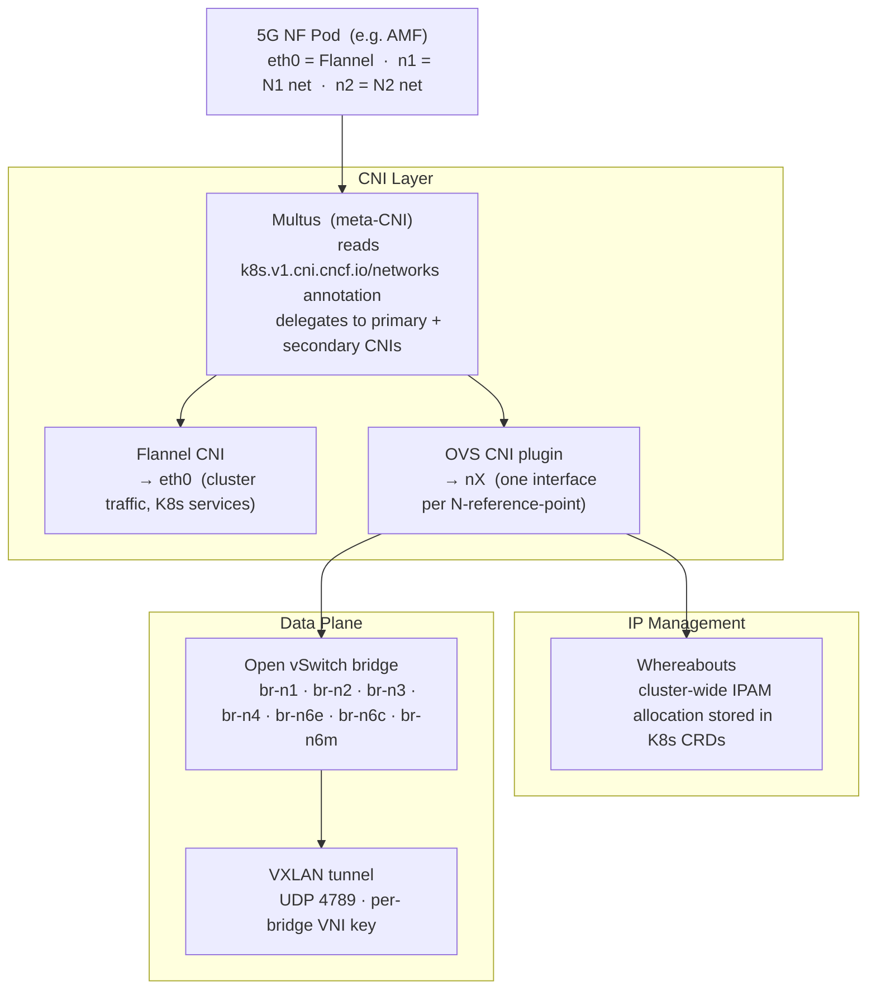
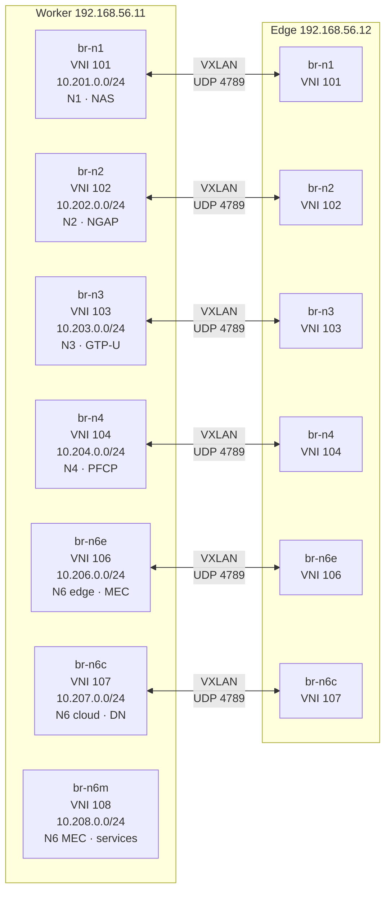
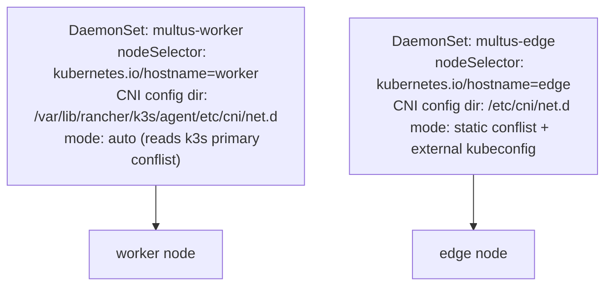
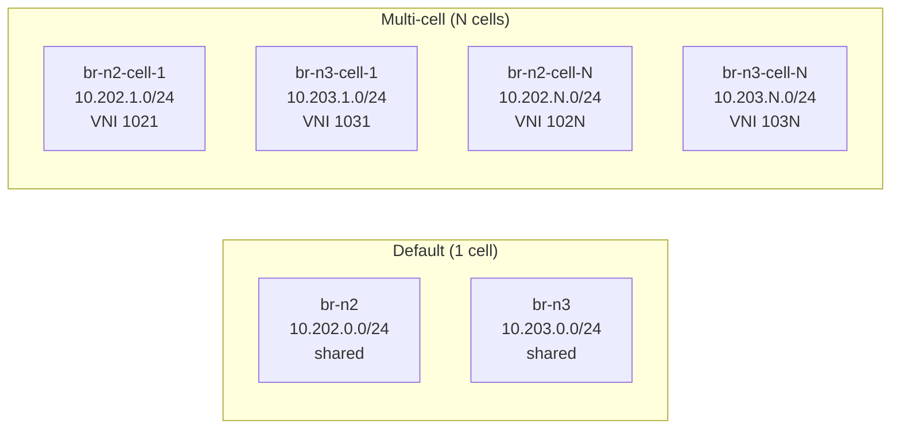
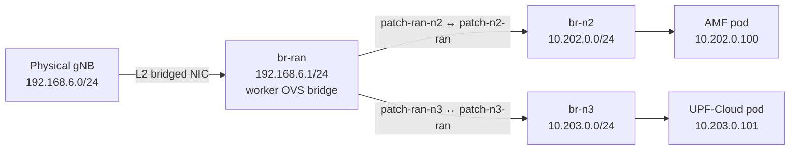

# Network Topology

This document explains the 5G overlay networking stack from first principles: why it exists, how each technology fits together, and what the actual bridge/tunnel topology looks like. Read [Virtualization Layers](virtualization-layers.md) first for context on why a secondary CNI is needed.

---

## The Problem: 5G Needs Multiple Isolated Interfaces

Standard Kubernetes gives every pod one network interface (`eth0`) via the primary CNI (Flannel in this cluster). That is sufficient for web services. It is not sufficient for 5G NFs.

A real 5G AMF must have:

- an **N1** interface (NAS signalling to UEs)
- an **N2** interface (NGAP control plane to gNBs)
- an **SBI** interface (Service-Based Interface to other NFs)

A UPF must have N3 (GTP-U from gNBs), N4 (PFCP from SMF), and N6 (towards the data network) — all on different subnets, all expected to be isolated from each other.

Putting everything on one Flannel interface is not acceptable: it breaks the 3GPP reference point architecture, mixes traffic from different planes on the same IP, and prevents per-interface traffic policies.

---

## The Solution Stack



### Multus (meta-CNI)

Multus is not a CNI itself — it is a shim that delegates to other CNIs. When a pod is created, Multus reads the `k8s.v1.cni.cncf.io/networks` annotation, calls the primary CNI first (Flannel → `eth0`), then calls each secondary CNI listed in the annotation (OVS → `n1`, `n2`, etc.).

```yaml
# Example pod annotation
metadata:
  annotations:
    k8s.v1.cni.cncf.io/networks: |
      [
        {"name": "n2-net", "interface": "n2"},
        {"name": "n3-net", "interface": "n3"}
      ]
```

Secondary interfaces are defined by **NetworkAttachmentDefinitions (NADs)** — Kubernetes CRDs that specify the CNI plugin and IPAM configuration for each network.

### OVS CNI plugin

The OVS CNI plugin connects a pod's network namespace to a named OVS bridge by creating a veth pair: one end in the pod netns (the `n2` interface), the other end plugged into the OVS bridge as a port. The pod can then send frames that traverse the OVS bridge and reach any other port on that bridge — including the VXLAN tunnel port to the peer node.

### Whereabouts IPAM

`host-local` IPAM (the Kubernetes default) allocates IPs from a per-node pool. Two pods on different nodes can get the same IP — fine for Flannel, catastrophic for the 5G overlays where AMF on worker and gNB on edge must reach each other by IP.

Whereabouts stores IP allocations in Kubernetes CRDs (`IPAllocation` objects), so it has cluster-wide visibility and ensures uniqueness across nodes. Static IP reservations (for NFs like AMF that need a predictable IP) are excluded from the dynamic pool in the NAD configuration.

### Open vSwitch

OVS is a programmable software switch. Unlike Linux bridge, it supports OpenFlow, QoS, traffic statistics, and per-flow rules. In this testbed it serves as the data plane for the 5G overlays:

- One OVS bridge per 5G interface (6 bridges total per node)
- VXLAN tunnel ports connect the worker and edge bridges for each network
- Optional patch ports bridge the physical RAN subnet into the N2/N3 bridges

---

## OVS Bridge Topology

### Six bridges per node



### Bridge reference table

| Bridge | VNI | Subnet        | Gateway    | Purpose                          |
| ------ | --- | ------------- | ---------- | -------------------------------- |
| br-n1  | 101 | 10.201.0.0/24 | 10.201.0.1 | N1 — NAS UE↔AMF                  |
| br-n2  | 102 | 10.202.0.0/24 | 10.202.0.1 | N2 — NGAP gNB↔AMF                |
| br-n3  | 103 | 10.203.0.0/24 | 10.203.0.1 | N3 — GTP-U gNB↔UPF               |
| br-n4  | 104 | 10.204.0.0/24 | 10.204.0.1 | N4 — PFCP SMF↔UPF                |
| br-n6e | 106 | 10.206.0.0/24 | 10.206.0.1 | N6 edge — MEC local breakout     |
| br-n6c | 107 | 10.207.0.0/24 | 10.207.0.1 | N6 cloud — internet data network |
| br-n6m | 108 | 10.208.0.0/24 | 10.208.0.1 | N6 MEC — UPF-Cloud ↔ MEC service pods |

### VXLAN tunnel configuration

Each VXLAN tunnel uses a dedicated VNI key so that frames from different 5G interfaces cannot cross-contaminate:

```bash
# Example: VXLAN port on br-n2 (worker side)
ovs-vsctl add-port br-n2 vxlan-n2 -- \
  set interface vxlan-n2 type=vxlan \
  options:key=102 \
  options:remote_ip=192.168.56.12 \
  options:local_ip=192.168.56.11
```

The VXLAN tunnel runs over the management NIC (`eth1`, 192.168.56.0/24) between worker and edge. All six bridge tunnels share this single physical link.

### MTU sizing and GTP-U encapsulation

VXLAN adds 50 bytes of header (14 outer Ethernet + 20 IP + 8 UDP + 8 VXLAN) to every frame, so overlay interfaces (`n1`…`n6m`) use `overlay_mtu: 1450` (defined in `ansible/group_vars/all.yml`) instead of the 1500 default of the underlying `eth1`.

The user plane adds a second layer of encapsulation on top of that. Packets leaving the UPF on `ogstun` are re-encapsulated by `open5gs-upfd` in GTP-U (~40 bytes of outer IP + UDP + GTP header) before being emitted on `n3` towards the gNB. Without MTU adjustment the chain is:

```
UE payload  →  ogstun (1500)  →  UPF encaps GTP-U (+40)  →  n3 (1450)  =  fragmentation or drop
```

To keep UE traffic inside the overlay budget without requiring any UE-side configuration, the UPF init scripts:

1. Set `ogstun` and `ogstun2` MTU to **1400** (leaves 10 bytes of headroom after GTP-U over the 1450 overlay).
2. Apply TCP MSS clamping to **1360** (= 1400 − 20 IP − 20 TCP) on both directions of the FORWARD chain for `ogstun`/`ogstun2`, so remote peers negotiate a segment size that survives GTP-U encapsulation regardless of what the UE advertises.

This keeps the overlay MTU (used by Multus/OVS for VXLAN framing) decoupled from the UE-visible MTU (constrained by GTP-U overhead). Implemented in:

- `ansible/phases/05-5g-core/scripts/upf_cloud_init.sh`
- `ansible/phases/05-5g-core/scripts/upf_edge_init.sh`

---

## Multus Deployment Details

### Why two DaemonSets

K3s and standalone containerd use different host paths for CNI configuration. A single DaemonSet cannot conditionally mount different paths on different nodes. Two DaemonSets solve this:



The same split applies to the **OVS DaemonSets** (one per node, same reason).

### Edge Multus: static conflist

On the edge node, Multus cannot use auto-mode because KubeEdge injects empty `KUBERNETES_SERVICE_HOST` and `KUBERNETES_SERVICE_PORT` environment variables. When Multus auto-generates its conflist, it reads these env vars to build the K8s API URL — empty values cause Multus to crash.

Solution: install a pre-written static conflist that hard-codes the API server URL and points to an external kubeconfig at `/var/lib/multus/multus.kubeconfig`.

See [known-issues/kubeedge-multus-env-injection.md](../known-issues/kubeedge-multus-env-injection.md) for the full root cause analysis.

---

## NetworkAttachmentDefinitions (NADs)

Each N-interface is defined as a NAD in the `5g` namespace. The NAD specifies the OVS bridge to attach to and the Whereabouts IPAM configuration:

```yaml
apiVersion: k8s.cni.cncf.io/v1
kind: NetworkAttachmentDefinition
metadata:
  name: n2-net
  namespace: 5g
spec:
  config: |
    {
      "cniVersion": "0.3.1",
      "type": "ovs",
      "bridge": "br-n2",
      "ipam": {
        "type": "whereabouts",
        "range": "10.202.0.0/24",
        "range_start": "10.202.0.10",
        "range_end": "10.202.0.250",
        "exclude": ["10.202.0.100/32"]
      }
    }
```

The `exclude` list prevents Whereabouts from assigning static NF IPs (like AMF's `10.202.0.100`) dynamically to other pods. NFs then request their exact static IP via pod annotations.

---

## Per-Cell Network Scaling

The default deployment creates one shared N2 and N3 bridge for all cells. For multi-cell scenarios (multiple gNBs), each cell gets its own dedicated N2/N3 bridge and VXLAN tunnel:



The per-cell bridges are created by the `cell_network_setup` role in Phase 4. The number of cells and their IDs are configured in `ansible/phases/06-ueransim-mec/vars/topology.yml`.

---

## Physical RAN Integration

When a physical gNB (femtocell) is connected, the worker creates an additional OVS bridge (`br-ran`) and links it into `br-n2` and `br-n3` via patch port pairs:



The worker performs L3 routing between the physical RAN subnet (192.168.6.x) and the overlay subnets (10.20x.x.x). Patch ports provide L2 connectivity within the worker OVS instance; the subnet boundary is crossed by IP routing. N4, N6, and N1 bridges remain completely isolated.

See [Physical RAN Integration](../deployment/physical-ran.md) for the step-by-step setup guide.

---

## Verification Commands

> **Context**: OVS commands run on `worker` or `edge` (via `vagrant ssh worker`). kubectl commands run from `master` using `sudo k3s kubectl`.

### Check OVS bridges

```bash
vagrant ssh worker   # or edge
sudo ovs-vsctl show
```

### Check VXLAN tunnels

```bash
sudo ovs-vsctl list interface | grep -A5 vxlan
```

### Check NADs

```bash
sudo k3s kubectl get net-attach-def -A
```

### Check pod network interfaces

```bash
# Verify AMF has n1 and n2 interfaces
sudo k3s kubectl -n 5g exec deploy/amf -- ip -o -4 addr

# Check Multus network-status annotation
sudo k3s kubectl -n 5g get pod -l app=amf -o json \
  | jq -r '.items[0].metadata.annotations["k8s.v1.cni.cncf.io/network-status"]' | jq .
```

### Check Whereabouts IP pools

```bash
sudo k3s kubectl get ippools.whereabouts.cni.cncf.io -A
```

---

## Troubleshooting

### VXLAN connectivity issues

```bash
# Test VXLAN UDP port reachability from worker to edge
nc -vzu 192.168.56.12 4789

# Check OVS bridge ports
sudo ovs-vsctl list-ports br-n2

# Check VXLAN tunnel state
sudo ovs-vsctl list interface vxlan-n2
```

### IP assignment issues

```bash
# Check Whereabouts IP pool status
sudo k3s kubectl get ippools.whereabouts.cni.cncf.io -A -o yaml

# Verify pod got expected IPs
sudo k3s kubectl -n 5g get pod <pod> \
  -o jsonpath='{.metadata.annotations.k8s\.v1\.cni\.cncf\.io/network-status}' | jq .
```

### Pod stuck in ContainerCreating

Usually a Multus or IPAM issue. Check:

```bash
sudo k3s kubectl -n 5g describe pod <pod>   # look at Events section
sudo k3s kubectl -n kube-system logs -l app=multus --tail=50
```

See [runbooks/multus-nad-ipam.md](../runbooks/multus-nad-ipam.md) and [runbooks/ovs-vxlan-health.md](../runbooks/ovs-vxlan-health.md) for detailed diagnostics.

---

## Related Documentation

- [Virtualization Layers](virtualization-layers.md) — why this networking layer exists
- [5G Interfaces](5g-interfaces.md) — per-interface subnets, protocols, and static IPs
- [Physical RAN Integration](../deployment/physical-ran.md) — bridging a real femtocell
- [Runbook: OVS VXLAN Health](../runbooks/ovs-vxlan-health.md)
- [Runbook: Multus NAD IPAM](../runbooks/multus-nad-ipam.md)
- [Known Issues: KubeEdge Multus Env Injection](../known-issues/kubeedge-multus-env-injection.md)
