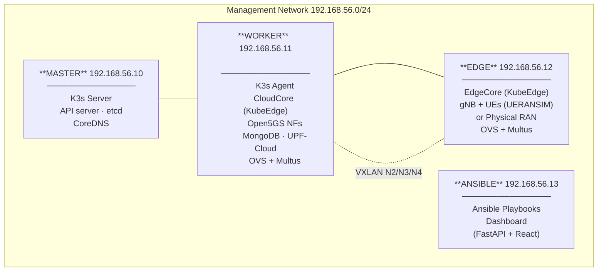
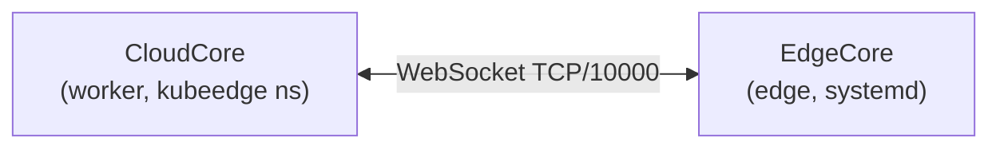
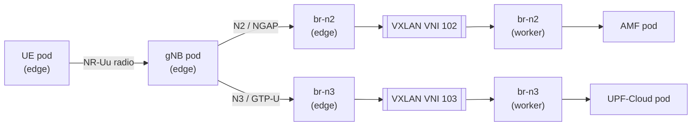
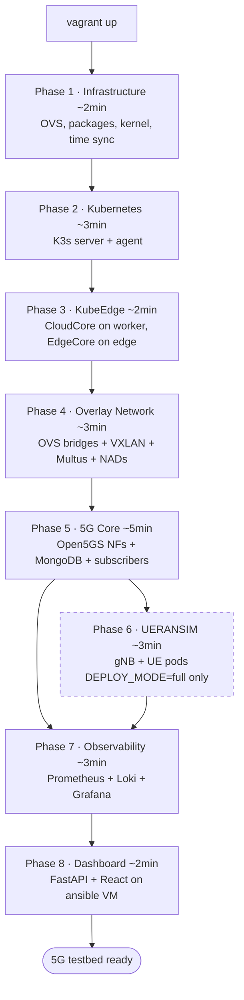

# Architecture Overview

This document describes what the system is, why it is built the way it is, and where each component runs. Read this before the other architecture documents.

## What This System Does

The testbed runs a complete 5G network stack — base station, user equipment, and 5G core — entirely on a single laptop. It is designed for:

- **5G protocol research**: real AMF/SMF/UPF/gNB interactions, not mocks
- **Edge computing experiments**: workloads split between a cloud node and an edge node
- **MEC (Multi-access Edge Computing)**: local traffic breakout via UPF-Edge
- **Physical RAN integration**: swap UERANSIM for a real femtocell without changing the core

Everything is automated via Ansible. A single `vagrant up` provisions 4 VMs, installs Kubernetes, deploys the 5G core, and starts the observability and control dashboard.

---

## Infrastructure: Four VMs

| Node | IP | vCPU | RAM | Role |
|------|-----|------|-----|------|
| master | 192.168.56.10 | 4 | 4 GB | K3s control plane |
| worker | 192.168.56.11 | 8 | 8 GB | K3s agent, CloudCore, 5G Core |
| edge | 192.168.56.12 | 4 | 4 GB | KubeEdge EdgeCore, RAN workloads |
| ansible | 192.168.56.13 | 2 | 1 GB | Ansible orchestration, Dashboard |

---

## Kubernetes Layer: K3s + KubeEdge

The cluster uses two different control paths depending on the node:

| Node | Kubernetes agent | Why |
|------|-----------------|-----|
| master | K3s server | Control plane |
| worker | K3s agent (standard) | Full Kubernetes features available |
| edge | KubeEdge EdgeCore only (no k3s-agent) | Avoids dual-kubelet conflict |

**Why no k3s-agent on the edge node?**
Running both k3s-agent and EdgeCore on the same node causes dual kubelet registration, competing CRI connections to containerd, and double pod management. The edge node runs standalone containerd + EdgeCore only. It appears as a standard Kubernetes Node in the API but is managed via the KubeEdge cloud-edge channel.

**KubeEdge channel:**

CloudCore runs on the **worker** node as a Kubernetes pod in the `kubeedge` namespace. EdgeCore runs as a systemd service on the edge node. Once connected, the edge node is schedulable like any other node.

**Known edge limitations** (documented with workarounds in [known-issues/](../known-issues/)):
- No CoreDNS access → pods can't resolve service names
- No automatic ConfigMap/Secret sync → inject values via env vars at deploy time
- ServiceAccount token projection bugs → set `automountServiceAccountToken: false`
- Multus env injection issue → use static conflist on edge instead of auto-mode

---

## Networking Layer: Flannel + OVS + Multus

The cluster uses two networking systems in parallel:

| System | Scope | Purpose |
|--------|-------|---------|
| Flannel (K3s default CNI) | All pods | Pod-to-pod connectivity, K8s services |
| OVS + Multus (secondary CNI) | 5G pods only | Isolated per-interface 5G networks |

**Why a secondary CNI?**
Standard Kubernetes gives every pod one network interface (eth0 via Flannel). 5G network functions need multiple dedicated interfaces — one per N-reference-point (N1, N2, N3, N4, N6). Multus acts as a meta-CNI: it calls the primary CNI first (Flannel), then attaches additional interfaces as requested via `k8s.v1.cni.cncf.io/networks` annotations. Each secondary interface connects the pod to a dedicated OVS bridge, which is tunnelled to the peer node via VXLAN.

See [Network Topology](network-topology.md) for the full OVS+VXLAN+Multus architecture.

---

## 5G Core Layer: Open5GS

All 5G Core Network Functions run as Kubernetes pods on the **worker** node:

| NF | Function | Interface(s) |
|----|----------|-------------|
| NRF | Network Repository Function — service discovery | SBI (HTTP/2) |
| AMF | Access & Mobility Management — UE registration | N1, N2, SBI |
| SMF | Session Management — PDU session control | N4, SBI |
| UPF-Cloud | User Plane Function — internet breakout | N3, N4, N6 |
| UPF-Edge | User Plane Function — MEC local breakout | N3, N4, N6 |
| UDM | Unified Data Management | SBI |
| UDR | Unified Data Repository | SBI |
| AUSF | Authentication Server Function | SBI |
| PCF | Policy Control Function | SBI |
| BSF | Binding Support Function | SBI |
| NSSF | Network Slice Selection Function | SBI |
| MongoDB | Subscriber database (UDR backend) | — |

NFs discover each other via NRF (Service-Based Interface over HTTP/2). Static IP assignments ensure NFs are reachable at predictable addresses on their respective N-interfaces — necessary because KubeEdge does not provide CoreDNS to edge pods.

---

## RAN Layer: Simulated or Physical

The testbed supports two RAN modes, selectable at deploy time or via the dashboard:

### UERANSIM (Simulated)

gNB and UE pods run on the edge node, scheduled via KubeEdge. They connect to AMF (N2) and UPF (N3) through the OVS overlay:

Topology is configurable in `ansible/phases/06-ueransim-mec/vars/topology.yml` (number of cells, UEs per cell, APN).

### Physical RAN (Femtocell)

A real gNB (e.g. nCELL-F2240) connects to the worker VM via a bridged NIC. The worker acts as a transport router: OVS patch ports bridge the physical RAN subnet (`192.168.6.0/24`) into the N2 and N3 overlays, letting the physical gNB reach AMF and UPF through the same logical paths as UERANSIM.

See [Physical RAN Integration](../deployment/physical-ran.md) for setup.

---

## Control Plane: Out-of-Band Dashboard

The dashboard runs on the **ansible VM** — separate from the 5G workloads by design. This mirrors professional network management architectures where the control surface is isolated from the production data/control plane to reduce blast radius.

| Service | URL | Purpose |
|---------|-----|---------|
| Dashboard UI | http://192.168.56.13:31573 | Web control plane |
| Dashboard API | http://192.168.56.13:31880/docs | REST API (FastAPI) |
| Grafana | http://192.168.56.11:30300 | Metrics & logs |
| Prometheus | http://192.168.56.11:30090 | Metrics scraping |

See [Dashboard Overview](../dashboard/overview.md) for full documentation.

---

## Deployment Flow

Running `vagrant up` executes the following sequence automatically:

After Phase 5 (without UERANSIM), the 5G core is running and waiting for a RAN to connect. UERANSIM can be added later or a physical gNB can be connected.

---

## Related Documentation

- [Virtualization Layers](virtualization-layers.md) — how the 5 abstraction layers stack on top of each other
- [Network Topology](network-topology.md) — OVS, VXLAN, Multus, and NADs in depth
- [5G Interfaces](5g-interfaces.md) — N1, N2, N3, N4, N6 subnets, protocols, and IPs
- [Deployment Phases](../deployment/phases.md) — what each phase does and how to run it individually
- [Dashboard Overview](../dashboard/overview.md) — dashboard architecture and modules
