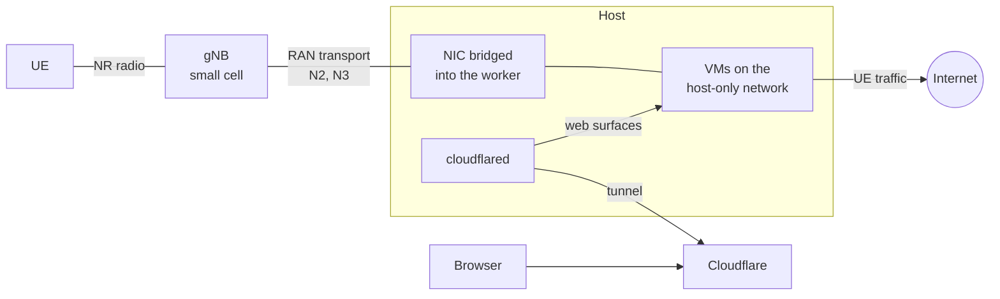
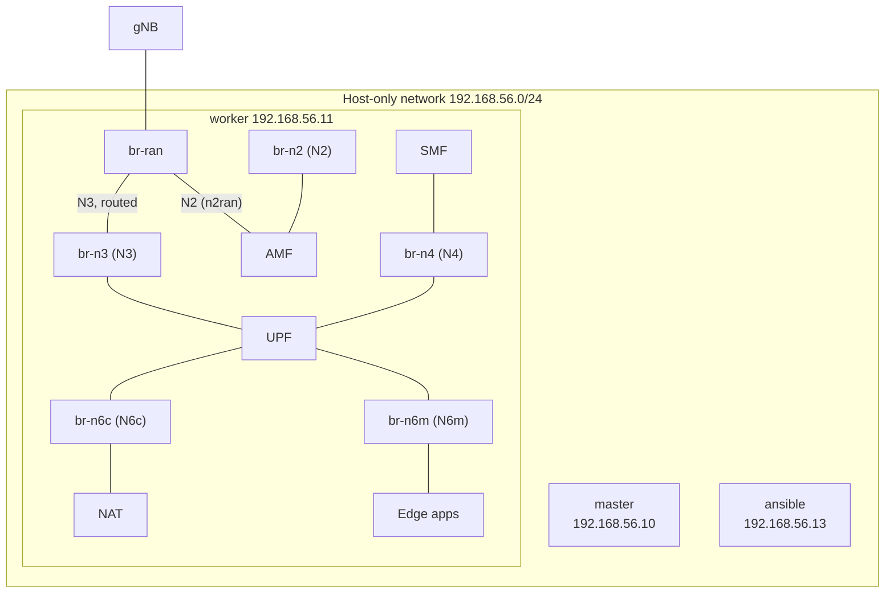
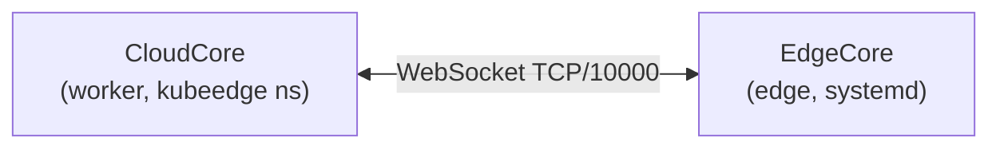
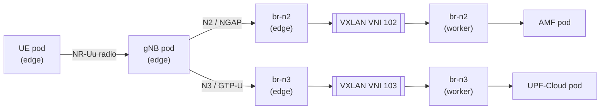
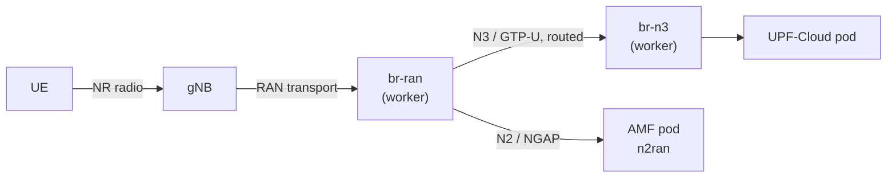
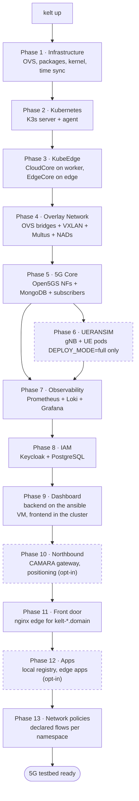

# Architecture Overview

KELT runs a 5G network on one Linux host: an Open5GS core on Kubernetes, a
radio access network that is either a physical gNB or UERANSIM, and an
operations dashboard. This document describes the machines, where each
component runs and how the deployment proceeds. The other architecture
documents describe each layer in detail.

## Components

- **5G core**: the Open5GS network functions, with NGAP, PFCP and GTP-U
  between them.
- **RAN**: a physical gNB on the RAN transport network, or UERANSIM pods.
- **Edge data network (N6m)**: application pods reached from the UE through the
  UPF, without NAT.
- **Edge node**: an optional KubeEdge node for workloads placed away from the
  worker.
- **Operations**: the dashboard, Keycloak for identity, and Prometheus, Loki and
  Grafana for monitoring.

`kelt up` provisions the VMs and runs the deployment phases with Ansible.

---

## Infrastructure: one host and its VMs

The VMs run under VirtualBox and share a host-only management network. The
`server` profile creates master, worker and ansible. The `laptop` profile, the
default, also creates an edge VM, as does `EDGE_ENABLED=true` on a server.

### Physical topology

```mermaid
flowchart LR
    UE["UE"]
    GNB["gNB<br/>small cell"]
    subgraph HOST["Host"]
        NIC["NIC bridged<br/>into the worker"]
        VMS["VMs on the<br/>host-only network"]
        CFD["cloudflared"]
    end
    NET(("Internet"))
    CF["Cloudflare"]
    BR["Browser"]

    UE -- "NR radio" --- GNB
    GNB -- "RAN transport<br/>N2, N3" --- NIC
    NIC --- VMS
    VMS -- "UE traffic" --> NET
    CFD -- "tunnel" --> CF
    BR --> CF
    CFD -- "web surfaces" --> VMS
```

The gNB reaches the core over the RAN transport network, the subnet set by
`physical_ran_subnet`, for N2 and N3, without NAT. A host NIC is bridged into
the worker VM on that segment; connecting a gNB is described in
[Physical RAN](../deployment/physical-ran.md). UE traffic to the internet leaves
the UPF on N6c, is translated by the UPF and by the worker, and exits through the
host uplink ([5G Interfaces](5g-interfaces.md#data-networks)). `cloudflared` on
the host keeps an outbound tunnel to Cloudflare, which carries the web surfaces
to the front door on the worker
([External tunnel](../deployment/external-tunnel.md)).

### Inside the host

```mermaid
flowchart TB
    GNB["gNB"]
    subgraph HOST["Host-only network 192.168.56.0/24"]
        M["master<br/>192.168.56.10"]
        A["ansible<br/>192.168.56.13"]
        subgraph W["worker 192.168.56.11"]
            BRAN["br-ran"]
            BN2["br-n2 (N2)"]
            BN3["br-n3 (N3)"]
            BN4["br-n4 (N4)"]
            BN6C["br-n6c (N6c)"]
            BN6M["br-n6m (N6m)"]
            AMF["AMF"]
            SMF["SMF"]
            UPF["UPF"]
            APP["Edge apps"]
            NAT["NAT"]
        end
    end

    GNB --- BRAN
    BRAN -- "N2 (n2ran)" --- AMF
    BRAN -- "N3, routed" --- BN3
    BN2 --- AMF
    BN3 --- UPF
    SMF --- BN4 --- UPF
    UPF --- BN6M --- APP
    UPF --- BN6C --- NAT
```

The master runs the K3s server, CoreDNS and part of the monitoring agents. The
worker runs the K3s agent and every other pod: the 5G network functions,
identity, the exposure services, the edge apps, the front door and the
dashboard frontend. The ansible VM runs the playbooks, the dashboard backend
and its watchdog, and is not a Kubernetes node. The edge VM, when present, runs
KubeEdge's EdgeCore; its maturity is recorded in [status](../status.md).

Each `br-*` box is the OVS bridge of one plane. N1 and N6e are not drawn. The
subnets and fixed addresses of the planes are in
[5G Interfaces](5g-interfaces.md); the bridges are in
[Network Topology](network-topology.md).

| Node | IP | vCPU / RAM, `server` | vCPU / RAM, `laptop` |
|------|-----|------|------|
| master | 192.168.56.10 | 2 / 3 GB | 4 / 4 GB |
| worker | 192.168.56.11 | 4 / 10 GB | 8 / 8 GB |
| ansible | 192.168.56.13 | 1 / 1 GB | 2 / 1 GB |
| edge | 192.168.56.12 | with `EDGE_ENABLED=true` | 4 / 4 GB |

The addresses are `node_ips` and `mgmt_subnet` in `ansible/group_vars/all.yml`;
the profiles are `TESTBED_PROFILE` in the Vagrantfile. The Vagrantfile creates
the VMs and the Ansible inventory from those addresses, and the roles read node
addresses from the inventory.

---

## Kubernetes Layer: K3s + KubeEdge

| Node | Kubernetes agent |
|------|-----------------|
| master | K3s server |
| worker | K3s agent |
| edge | KubeEdge EdgeCore, with its own containerd and no K3s agent |

CloudCore runs as a pod in the `kubeedge` namespace on the worker. EdgeCore
runs as a systemd service on the edge node and connects to CloudCore; the edge
node then appears in the API as a schedulable node.

```mermaid
graph LR
    CC["CloudCore
    (worker, kubeedge ns)"]
    EC["EdgeCore
    (edge, systemd)"]
    CC <-->|"WebSocket TCP/10000"| EC
```

The edge node has known limitations, each with its workaround in
[known-issues/](../known-issues/):

- pods on it cannot resolve cluster service names (no CoreDNS);
- ConfigMaps and Secrets are not synced, so values are injected as environment
  variables at deploy time;
- projected ServiceAccount tokens fail, so edge pods set
  `automountServiceAccountToken: false`;
- Multus runs with a static conflist instead of auto-mode.

---

## Networking Layer: Flannel + OVS + Multus

| System | Scope | Provides |
|--------|-------|---------|
| Flannel (K3s default CNI) | All pods | Pod-to-pod connectivity, Kubernetes services |
| OVS + Multus (secondary CNI) | 5G pods and edge apps | One interface per plane, each on its own OVS bridge |

Every pod gets its first interface from Flannel. Multus adds the further
interfaces a pod requests in its `k8s.v1.cni.cncf.io/networks` annotation, each
attached to the OVS bridge of a plane. With an edge node, the bridges of the
worker and of the edge are joined by VXLAN.
[Network Topology](network-topology.md) describes the OVS, VXLAN and Multus
layer.

---

## 5G Core Layer: Open5GS

The network functions run as pods on the worker:

| NF | Function | Interface(s) |
|----|----------|-------------|
| NRF | Network Repository Function — service discovery | SBI (HTTP/2) |
| AMF | Access & Mobility Management — UE registration | N1, N2, SBI |
| SMF | Session Management — PDU session control | N4, SBI |
| UPF-Cloud | User Plane Function — the anchor of every session | N3, N4, N6c, N6m |
| UPF-Edge | User Plane Function — configured, serves no session | N3, N4, N6e |
| UDM | Unified Data Management | SBI |
| UDR | Unified Data Repository | SBI |
| AUSF | Authentication Server Function | SBI |
| PCF | Policy Control Function | SBI |
| BSF | Binding Support Function | SBI |
| NSSF | Network Slice Selection Function | SBI |
| MongoDB | Subscriber database (UDR backend) | — |

The network functions find each other through the NRF over the
Service-Based Interface (HTTP/2). Fixed addresses are kept only where a peer
needs the address in its configuration (the gNB needs the AMF, the SMF lists the
UPF); [5G Interfaces](5g-interfaces.md) lists them.

---

## RAN Layer: Simulated or Physical

### UERANSIM (Simulated)

The gNB and UE pods are placed on the edge node by default (`node_defaults` in
`ansible/phases/06-ueransim-mec/vars/topology.yml`) and reach the AMF (N2) and the
UPF (N3) through the overlay. Without an edge VM they need another node. Its
maturity is recorded in [status](../status.md).

```mermaid
graph LR
    UE["UE pod
    (edge)"]
    GNB["gNB pod
    (edge)"]
    BR_N2_E["br-n2
    (edge)"]
    BR_N3_E["br-n3
    (edge)"]
    VXLAN_N2[["VXLAN VNI 102"]]
    VXLAN_N3[["VXLAN VNI 103"]]
    BR_N2_W["br-n2
    (worker)"]
    BR_N3_W["br-n3
    (worker)"]
    AMF["AMF pod"]
    UPF["UPF-Cloud pod"]

    UE -->|"NR-Uu radio"| GNB
    GNB -->|"N2 / NGAP"| BR_N2_E --> VXLAN_N2 --> BR_N2_W --> AMF
    GNB -->|"N3 / GTP-U"| BR_N3_E --> VXLAN_N3 --> BR_N3_W --> UPF
```

The same file sets the number of cells, the UEs per cell and their DNN.

### Physical RAN

```mermaid
graph LR
    UE["UE"]
    GNB["gNB"]
    BRAN["br-ran
    (worker)"]
    BN3["br-n3
    (worker)"]
    AMF["AMF pod
    n2ran"]
    UPF["UPF-Cloud pod"]

    UE -->|"NR radio"| GNB
    GNB -->|"RAN transport"| BRAN
    BRAN -->|"N2 / NGAP"| AMF
    BRAN -->|"N3 / GTP-U, routed"| BN3 --> UPF
```

A physical gNB is on the RAN transport network, bridged into the worker VM as
`br-ran`. The AMF has an interface on `br-ran`, `n2ran`, where the gNB's NGAP
association terminates. The worker routes GTP-U from `br-ran` to `br-n3` and the
UPF. Connecting a gNB is described in
[Physical RAN Integration](../deployment/physical-ran.md).

---

## Operations: the dashboard

The dashboard backend runs on the ansible VM, outside the cluster; its frontend
runs in the cluster, with an optional development frontend on the ansible VM.
Access and the two frontends: [Dashboard Overview](../dashboard/overview.md#access).
Grafana and Prometheus: [Phase 7](../deployment/phases.md).

---

## Deployment Flow

`kelt up` runs the phases in this order; dashed phases are optional:

```mermaid
flowchart TD
    V["kelt up"] --> P1
    
    P1["Phase 1 · Infrastructure
    OVS, packages, kernel, time sync"]
    
    P2["Phase 2 · Kubernetes
    K3s server + agent"]
    
    P3["Phase 3 · KubeEdge
    CloudCore on worker, EdgeCore on edge"]
    
    P4["Phase 4 · Overlay Network
    OVS bridges + VXLAN + Multus + NADs"]
    
    P5["Phase 5 · 5G Core
    Open5GS NFs + MongoDB + subscribers"]
    
    P6["Phase 6 · UERANSIM
    gNB + UE pods DEPLOY_MODE=full only"]
    
    P7["Phase 7 · Observability
    Prometheus + Loki + Grafana"]
    
    P8["Phase 8 · IAM
    Keycloak + PostgreSQL"]

    P9["Phase 9 · Dashboard
    backend on the ansible VM, frontend in the cluster"]

    P10["Phase 10 · Northbound
    CAMARA gateway, positioning (opt-in)"]

    P11["Phase 11 · Front door
    nginx edge for kelt-*.domain"]

    P12["Phase 12 · Apps
    local registry, edge apps (opt-in)"]

    P13["Phase 13 · Network policies
    declared flows per namespace"]
    DONE(["5G testbed ready"])

    P1 --> P2 --> P3 --> P4 --> P5
    P5 --> P6
    P5 --> P7
    P6 --> P7
    P7 --> P8 --> P9 --> P10 --> P11 --> P12 --> P13 --> DONE

    style P6 stroke-dasharray: 5 5
    style P10 stroke-dasharray: 5 5
    style P12 stroke-dasharray: 5 5
```

After phase 5 the core is running and waits for a RAN: UERANSIM (phase 6) or a
physical gNB. Each phase is described in [Deployment Phases](../deployment/phases.md).

---

## Related Documentation

- [Virtualization Layers](virtualization-layers.md): the layers from host to network functions
- [Network Topology](network-topology.md): OVS, VXLAN, Multus and NADs
- [5G Interfaces](5g-interfaces.md): planes, subnets, fixed addresses, protocols
- [Deployment Phases](../deployment/phases.md): each phase and how to run it alone
- [Dashboard Overview](../dashboard/overview.md): dashboard architecture and modules
