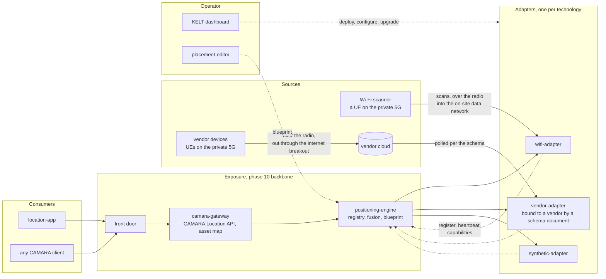
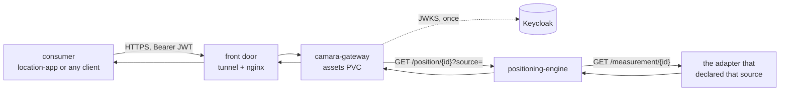
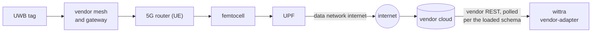
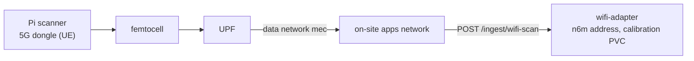
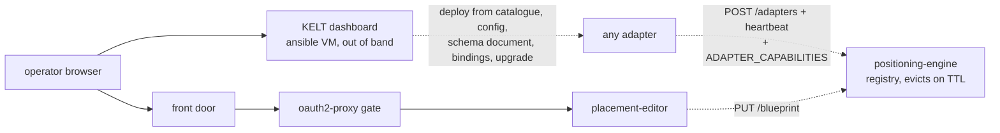

# Positioning Adapters

The positioning subsystem is split into two concerns: a thin engine that
fuses measurements into a unified position, and a set of adapters that
each speak to one positioning technology (Wi-Fi RSSI, vendor RTLS, UWB,
or any future source). Phase 10 (northbound), positioning_engine role,
deploys the engine plus a standalone
`synthetic-adapter` (a Tier-1 synthetic/UWB source that exercises the real
adapter HTTP contract out of the box) and, opt-in, the `placement-editor`
geometry UI. Real-source adapters (`wifi-adapter`, the generic `vendor-adapter`,
and bring-your-own images) are provisioned at runtime from the dashboard, not by
Ansible.

## Layers

Solid arrows carry data at runtime; dashed arrows are control, crossed once
or on a heartbeat.

Read it left to right. A consumer only ever sees the gateway, through the
front door, and names things by `assetId`. The gateway resolves the asset
to the source that tracks it and asks the engine; the engine never talks to
a measurement source itself: it polls the adapter that declared that
source over `GET /measurement/{id}` and converts the answer to WGS84 with
its blueprint. Adapters register with the engine when they start and keep
a heartbeat, carrying their capabilities (source name, kinds, frame,
precision class); a silent adapter is evicted and the rest keeps serving.
With no adapter tracking an asset the gateway answers `422 UNABLE_TO_LOCATE`.

The two real sources reach their adapters differently, and both cross the
private 5G: the Wi-Fi scanner is a UE whose scans land on the on-site data
network, so the fix is computed on site; the vendor's devices are UEs too,
but their gateway talks to the vendor's cloud through the internet
breakout, and the vendor-adapter reads the fix back from there. The
synthetic-adapter is the source the backbone ships with, so the whole path
works with no hardware. The flows are drawn one at a time in
[Deployment view](#deployment-view-the-flows-as-they-run-in-the-testbed).

## Public adapter contract

The HTTP contract that adapters must implement, the request/response
schemas, the health probe shape, and the reference implementation
(`wifi-adapter`) all live in the `5g-northbound` monorepo, alongside
the engine code that consumes them. See:

- `5g-northbound/docs/adapter-contract.md` for the protocol spec
- `5g-northbound/wifi-adapter/` for the reference implementation

This testbed pulls the published images and orchestrates them; the
contract itself is owned by the upstream repository so it can evolve
without a testbed release.

## What the positioning_engine role provisions

| Resource | Purpose |
|----------|---------|
| `Namespace positioning` | Isolation boundary for engine and all adapters |
| `ConfigMap positioning-engine-wiring` | Deployment wiring, rewritten on every run from `all.yml`: `DEVICE_IDS`, `BLUEPRINT_SEED_PATH`. No static `ADAPTER_URLS`: adapters self-register (an optional seed is rendered only if `engine_adapter_urls` is set) |
| `ConfigMap positioning-engine-config` | Operator settings (`DEVICE_MAP`, `FUSION_STRATEGY`, `FUSION_COMPARE`, `WEBSOCKET_INTERVAL_MS`): seeded once from the role defaults, then owned by the dashboard Configure form; the role never rewrites it. Listed after the wiring in `envFrom`, so it wins |
| `Deployment positioning-engine` | Single replica, image from `5g-northbound`, REST + WebSocket on `8080`; the `synthetic-adapter` deployed by the same role is its baseline source |
| `Service positioning-engine` | ClusterIP plus NodePort `31930` |
| `Deployment/Service synthetic-adapter` | Standalone reference synthetic adapter (ClusterIP), source `synthetic`; the engine discovers it from its `devices` capability so the demo shows live movement out of the box |
| `PVC positioning-blueprint` | Engine-owned blueprint store, RWO at `/app/data`; only the engine mounts it. The engine serves `GET/PUT /blueprint` |
| `ConfigMap positioning-blueprint-seed` | Cold-start default room + `gps_origin`, read once via `BLUEPRINT_SEED_PATH` when the blueprint PVC is empty |
| `Deployment/Service placement-editor` | Opt-in (`placement_editor_enabled`): geometry authoring UI, ClusterIP. A write-client that PUTs the authored blueprint to the engine (`POSITIONING_ENGINE_URL`); mounts no PVC |
| `oauth2-proxy-placement` (Deployment/Service/Secret) | Opt-in: Keycloak gate in front of placement-editor on NodePort `31950`; admits only `g-dashboard-admins` (realm client `placement-editor-proxy`) |

Adapters self-register with the engine and heartbeat, so they appear and
disappear in the live registry without an engine restart; an asset nobody
tracks is answered `422 UNABLE_TO_LOCATE` by the gateway, not with a guess.

### Blueprint distribution

The room geometry (the blueprint) is network-distributed with a single
authority: the **engine** persists it on its own PVC and serves `GET/PUT
/blueprint`. The placement-editor PUTs the authored blueprint; the demo GETs
it through the CAMARA gateway (a MEC app talks only to the gateway); adapters
that need geometry GET it from the engine. There is no shared PVC and no
file-mount across services, which keeps every consumer network-driven (the
same model the edge Wi-Fi scanner already uses). The blueprint schema, the
endpoint contract, and the bindings-vs-blueprint split are owned upstream:
see `5g-northbound/docs/blueprint-vs-bindings.md`.

### Who is broadcast on the live WebSocket

Since engine `0.8.19` the live broadcast set, and each device's `source`, are
derived from the adapters' `devices` capability
([API reference](https://jacobbista.github.io/5g-northbound/api-reference/)):
the engine asks every registered adapter which devices it currently reports and
broadcasts those, routing each to the adapter that reported it. An onboarded
asset therefore goes live as soon as its adapter reports it, and there is no
fan-out fusion across adapters.

`DEVICE_IDS` on the engine is now only a cold-start seed, used when no adapter
advertises any device; `DEVICE_MAP` is a legacy manual `id=source` override.
Because the synthetic-adapter advertises the synthetic demo device through the
same capability, its deployment carries its own `DEVICE_IDS`
(`engine_device_ids`), otherwise the demo walk would never appear.

## Adding an adapter

Adapters **self-register** with the engine (v0.6.0). On boot each adapter POSTs
its name + base URL + kind to the engine (`POST /adapters`, target
`POSITIONING_ENGINE_URL`) and heartbeats; the engine is the registry authority
and evicts a self-registration that stops heartbeating after `ADAPTER_TTL_S`.
There is no static `ADAPTER_URLS` list to maintain and no rollout to trigger:
deploy an adapter and it announces itself within a heartbeat. The registry,
the endpoint contract, and the heartbeat/TTL semantics are owned upstream:
see `5g-northbound/docs/adapter-registry.md`.

`ADAPTER_URLS` survives only as an optional cold-start **seed** the engine reads
once when its registry is empty (for an off-cluster adapter that cannot
self-register); the baseline `synthetic-adapter` self-registers, so the testbed
leaves it unset. The adapter Deployment must expose `GET /health` (no auth) and
`GET /measurement/{id}` per the public contract.

### Dashboard provisioning

The dashboard Northbound page (`/northbound`, backend `/api/v1/northbound/*`)
shows the **live registry** read from the engine (`GET /adapters`): per adapter
its `kind`, `registeredVia` (self/seed/manual), `lastSeenSAgo`, and a derived
`state` (live / unreachable / stale). It does not register adapters by hand;
it deploys adapter images that then self-register, and can force-remove a stale
entry (`DELETE /adapters/{name}`). Two ways to add a positioning source without
touching Ansible:

1. **Bring your own adapter image.** Deploy-from-image: give a name,
   `image:tag`, port, env vars (secret-marked vars go into a Secret), and an
   optional `imagePullSecret` for private images. The backend creates the
   Deployment + ClusterIP Service in the `positioning` namespace (pinned to the
   worker node) and injects the self-registration env (`POSITIONING_ENGINE_URL`,
   `ADAPTER_NAME`, `ADAPTER_BASE_URL`) so the adapter announces itself. What the
   adapter is comes from the image itself (its `adapter:` family) and from
   `ADAPTER_CAPABILITIES` set afterwards in Configure; the deploy form asks for
   nothing else. The catalog pre-fills the reference `wifi-adapter`.

2. **No new code: the generic `vendor-adapter`.** Deploy the stock
   `vendor-adapter` image, then declare a schema that maps any REST API to the
   `Measurement` shape (the adapter persists the schema; the dashboard can
   write it via the adapter's `PUT /schema`). Credentials are mounted from a
   Secret.

Deploy-from-image is admin-only and additionally gated by the backend
`allow_workload_create` setting; every write is audited. See
`docs/dashboard/modules.md` and `docs/dashboard/api-reference.md`.

### Who owns a service's env

Every backbone service (gateway, engine, location-app) reads its env from two
ConfigMaps, in this order: `<deployment>-wiring`, written by its phase 10 role
from `all.yml` on every run, and `<deployment>-config`, seeded once by the role
with the defaults and from then on owned by the dashboard Configure form. A later
`envFrom` source wins, so an operator setting overrides the seed and a re-run of
the phase never puts it back. Inline `env` on the Deployment (the gateway's
client secret) is wiring too, and beats both. Catalog adapters have no wiring
ConfigMap: the dashboard creates `<name>-config` at deploy time and writes the
registration env into it.

The backend reads the live Deployment to tell the two apart (which source
actually provides each contract variable), so Configure offers only what the
operator owns and refuses to write a key the deployment provides elsewhere.
Wiring and storage paths are shown read-only in the service's info panel.

`ADAPTER_CAPABILITIES` is where a deployment states the traits of the source
it is bound to (source, kinds, frame, z, accuracy_class, nominalAccuracy): since
0.17.0 the generic vendor-adapter image bakes none of them. Adapters from 0.17.1
declare the variable in their contract (`type: json`); for one still on 0.17.0
the dashboard adds the entry itself (marked `declared by KELT`). Either way the
form renders it as a guided editor pre-filled from what the adapter advertises
in the engine registry and from its mounted schema (vendor, frame, height), and
`accuracy_class` is offered from the gateway's published
`/contracts/accuracy-class-vocabulary.json`, never from a list in the dashboard.
An adapter with no source declared is dropped by the engine, so this is the
first thing to confirm after deploying a vendor adapter from the catalog. The
contract also reports `transports` (what the image implements) and `transport`
(what the active schema chose); with one implemented transport the form states
it as a fact, the schema's own `transport` field is where a choice would live.

## Deployment view: the flows as they run in the testbed

The upstream [architecture page](https://jacobbista.github.io/5g-northbound/architecture/)
describes the contracts and who defines them, one flow at a time. This does
the same for the deployed shape: the same components placed on the testbed's
network, with the devices that feed them, one flow per drawing.

### One CAMARA retrieve, end to end

The consumer reaches only the gateway, through the front door; the gateway
resolves `assetId` to the source and the identifier that source knows the
asset by, the engine asks that adapter, converts to WGS84 with its blueprint,
and the circle goes back. Measured on the testbed: about 22 ms inside the
pipeline (gateway in to gateway out), see `experiments/`.

### A vendor fix, from the tag to the adapter

The vendor's devices ride the private 5G like any UE, but their gateway
talks to the vendor's cloud: the fix is computed there and leaves the site.
The vendor-adapter reads it back over the cluster's ordinary internet
egress, keeps it for a few seconds (`cacheTtl` in the schema) and serves it
to the engine. Nothing of this path enters the site's data network.

### A Wi-Fi fix, from the scanner to the adapter

The scan crosses the radio and lands on the on-site data network, where the
wifi-adapter has an extra interface with a reserved address; the fix is
computed in the adapter, on site. Same 5G as the vendor path, different
exit: this is the shape the vendor path would take with a local feed.

### Adapters announce themselves; operators configure them

Adapters register with the engine and keep a heartbeat; the engine is the
registry the gateway routes by. The operator never touches a pod: the
dashboard deploys catalogue adapters, writes their config and secrets,
loads the schema document and runtime choices, and rolls them; the
placement editor, behind its gate, writes the blueprint the engine owns.

### Where each piece runs

| Component | Runs | Reached by | Keeps |
|---|---|---|---|
| 5G core | worker VM, namespace `5g` | the femtocell on the RAN boundary | subscribers in MongoDB |
| wifi-adapter | catalogue deployment, one extra interface on the `mec` data network | UE-side scanners over the radio, the engine in-cluster | calibration on a PVC |
| vendor-adapter (`wittra`) | catalogue deployment, cluster network only | the engine; itself reaches the vendor cloud via egress | schema document in a ConfigMap |
| synthetic-adapter | phase 10 backbone | the engine | nothing |
| positioning-engine | phase 10 backbone | adapters register to it, the gateway and the editor call it | blueprint on a PVC, adapter registry in memory |
| camara-gateway | phase 10 backbone | consumers through the front door | asset map on a PVC |
| placement-editor | phase 10 backbone, behind the oauth2-proxy gate | operators through the front door | nothing (writes the engine's blueprint) |
| Keycloak | namespace `iam` | the gateway (JWKS, in-cluster), browsers through the front door | realm, users, clients |
| KELT dashboard | ansible VM, out of band | operators | nothing of the positioning state; it writes ConfigMaps, Secrets and deployments |

Addresses, ports and the data-network subnets are owned by
[5g-interfaces.md](5g-interfaces.md); the front door by
[../security/external-access.md](../security/external-access.md); the
`mec` namespace and its reserved addresses by [edge-apps.md](edge-apps.md).

## Backbone versus catalog: why the split

The split keeps the public testbed reproducible and the operational state
mutable. Ansible phases describe what the backbone looks like at the
start of every deployment, identically across users. Adapters depend on
who is using the testbed and on which hardware is connected; pinning them
in Ansible would push specific vendor or topology choices into a generic
artifact. Moving adapter provisioning to runtime keeps the published
contract vendor-neutral, lets each operator wire only the sources they
have, and supports private adapter images that must not appear in the
public repository.

## See also

- [Phase 10 Northbound README](https://github.com/Jacobbista/kelt/blob/main/ansible/phases/10-northbound/README.md) implementation notes for the CAMARA gateway, positioning engine, and demo
