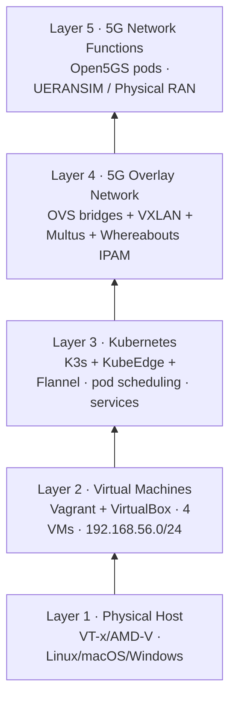
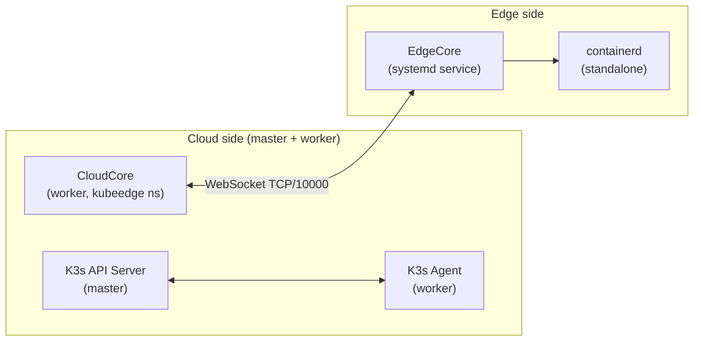
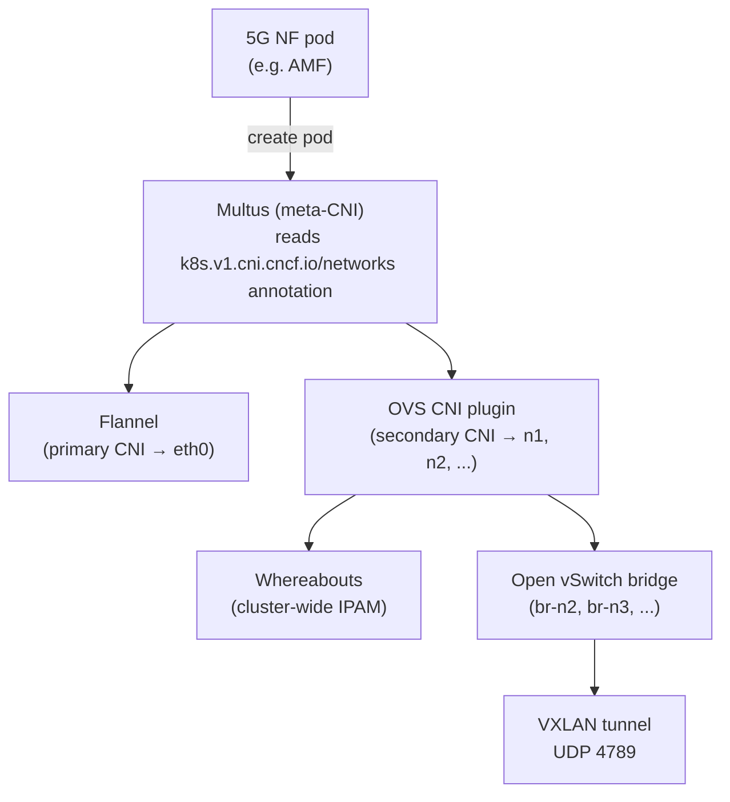
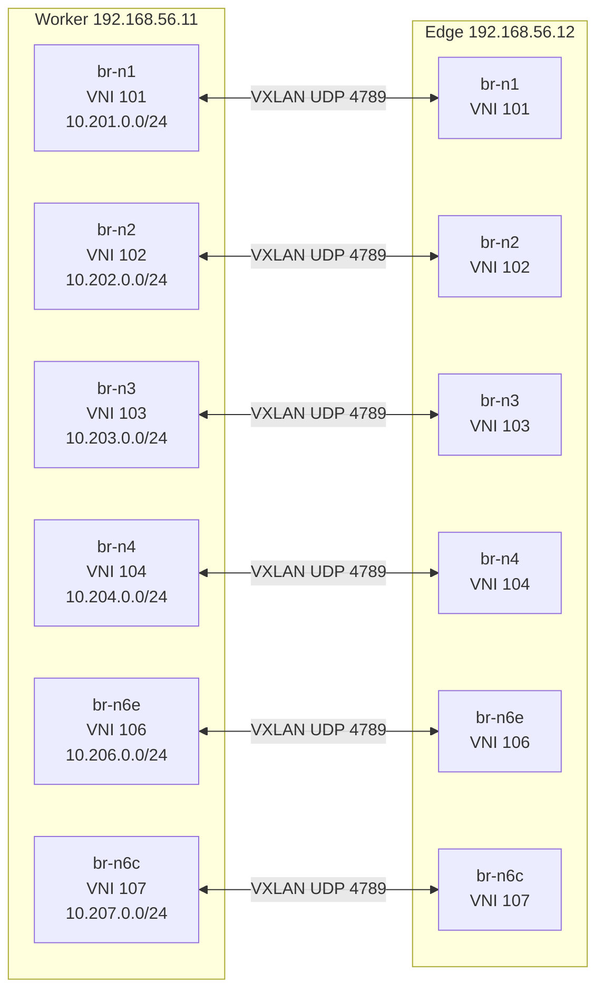
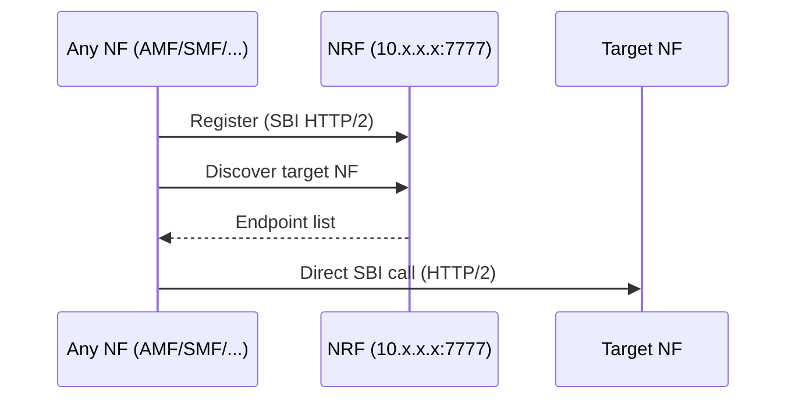
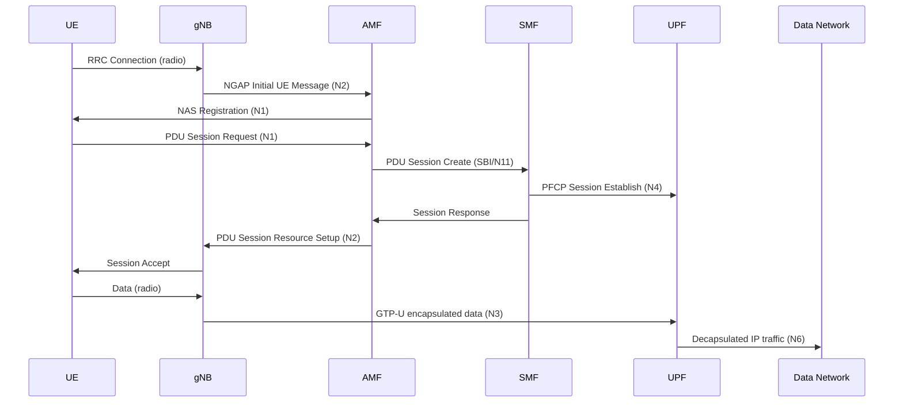
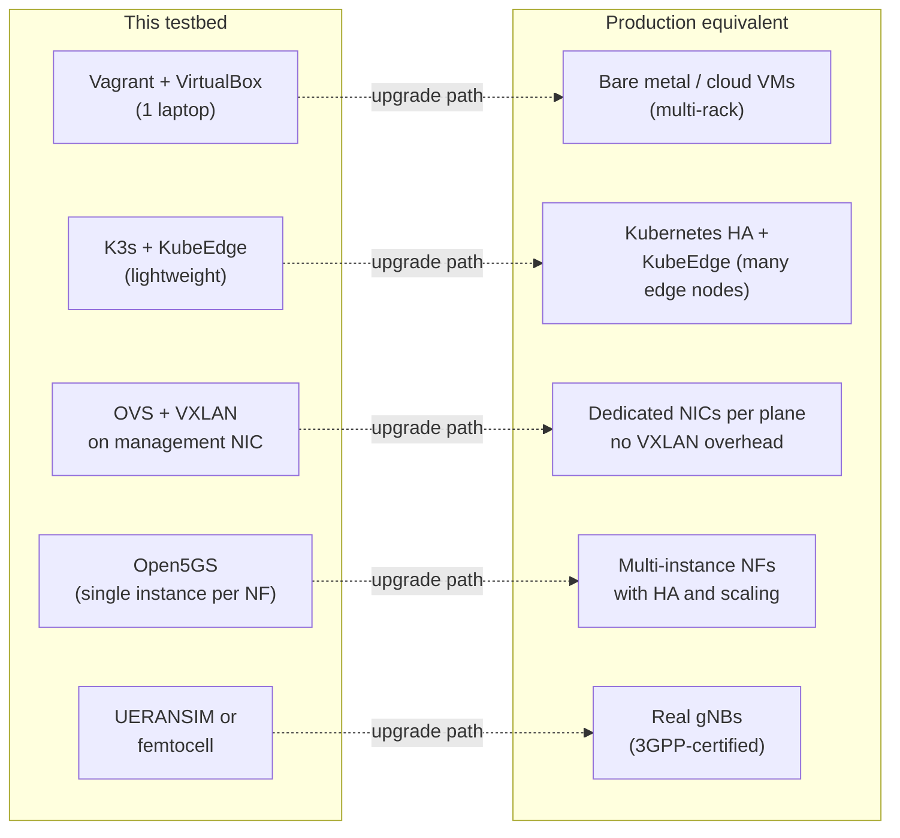

# Virtualization Layers

The testbed is built as a stack of five abstraction layers, each providing a different level of isolation and programmability. Understanding this stack is essential for debugging, scaling, and reasoning about what happens when something fails.

Read each section top-down to understand what each layer provides, how it is implemented, and where its limits are.

---

## Layer 1: Physical Host

### What it provides

Hardware compute, storage, and the hypervisor entry point. All four VMs share this host's CPU, RAM, and NIC.

### Requirements

| Resource | Minimum | Recommended |
|----------|---------|-------------|
| CPU | 4 cores (with VT-x/AMD-V) | 8+ cores |
| RAM | 16 GB | 24 GB |
| Disk | 40 GB free | 60 GB SSD |
| OS | Linux, macOS, Windows | Linux (fewest surprises) |
| Virtualisation | VT-x or AMD-V enabled in BIOS | — |

The physical NIC is only involved when using **Physical RAN** mode: the host NIC that is connected to the femtocell is bridged into the worker VM via VirtualBox bridged networking (`PHYSICAL_RAN_BRIDGE=<nic>`).

### Scaling limits

A single host is the fundamental constraint. All four VMs compete for the same physical CPU and RAM. The worker node carries the heaviest load (8 vCPU, 8 GB RAM) because it runs all 5G Core NFs. On a host with fewer than 16 GB RAM total, the worker may OOM under load.

### Production path

Replace VirtualBox with bare metal or a cloud hypervisor (KVM, ESXi, AWS/GCP). The Ansible automation is hypervisor-agnostic, so only the Vagrantfile needs to be replaced with a different provisioner.

---

## Layer 2: Virtual Machines

### What it provides

Network isolation, resource limits, and OS-level separation between nodes. Each VM has its own kernel, network stack, and file system. The 192.168.56.0/24 management network connects all four VMs.

### Technology

- **Vagrant**: declarative VM lifecycle (create, provision, destroy)
- **VirtualBox**: hypervisor providing CPU/RAM/NIC virtualisation
- **VM networking**: two types of interfaces per VM:
  - `eth0` (NAT): internet access for package downloads
  - `eth1` (host-only, 192.168.56.0/24): inter-VM communication and cluster traffic

The 5G overlay traffic (N2, N3, N4 VXLAN) rides on top of `eth1`. This means all 5G-plane traffic shares the same management NIC, acceptable in a testbed, not ideal for production.

### Key configuration

The `Vagrantfile` controls:
- VM sizes (vCPU, RAM)
- Network assignment (host-only IP)
- Physical RAN bridging (`public_network` on worker when `PHYSICAL_RAN_BRIDGE` is set)
- Ansible provisioner invocation (triggers `00-main-playbook.yml`)

### Scaling limits

- **Single-host topology**: All VMs on the same physical machine, so inter-VM "network" is actually shared memory via VirtualBox virtual switch. Latency is sub-millisecond; throughput is limited by memory bandwidth, not NIC speed.
- **VirtualBox kernel module**: Can conflict with other hypervisors (VMware, Hyper-V). On Linux, KVM is a better long-term choice.
- **Static IP assignment**: All node IPs are hardcoded in `ansible/group_vars/all.yml`. Adding a fourth compute node requires updating both the Vagrantfile and group_vars.

### Production path

Replace Vagrant + VirtualBox with:
- **Bare metal**: remove the VM layer entirely; run K3s and KubeEdge directly on physical servers
- **Cloud VMs**: use Terraform + cloud-init instead of Vagrant; the Ansible plays remain the same
- **KVM**: use `vagrant-libvirt` instead of VirtualBox for a more Linux-native experience

---

## Layer 3: Kubernetes

### What it provides

Container orchestration: pod scheduling, service discovery (for cloud nodes), secrets/configmap distribution, rolling updates, and health-based restarts. This layer gives the 5G NFs their lifecycle management.

### Technology

| Component | Node | Role |
|-----------|------|------|
| K3s Server | master | API server, etcd, scheduler, controller manager, CoreDNS |
| K3s Agent | worker | Standard kubelet, kube-proxy |
| CloudCore | worker (pod) | KubeEdge cloud-side controller |
| EdgeCore | edge (systemd) | Lightweight kubelet replacement |
| containerd | edge (standalone) | CRI for EdgeCore — not the k3s containerd |

**Why no k3s-agent on edge**: k3s-agent and EdgeCore both implement the kubelet interface. Running both causes dual registration (same hostname registered twice), competing CRI access, and double pod management. The edge runs EdgeCore-only with a standalone containerd installed separately from k3s.

### Edge node limitations (KubeEdge specifics)

These are not bugs: they are known constraints of the KubeEdge architecture. Workarounds are documented in [known-issues/](../known-issues/):

| Limitation | Cause | Workaround |
|------------|-------|------------|
| No CoreDNS | EdgeCore does not proxy DNS to the cluster | Pods use static IPs; init containers query K8s API directly |
| ConfigMap sync unreliable | EdgeCore's metadata sync has edge cases | Inject values as env vars at deploy time from Ansible |
| ServiceAccount token bugs | Token projection fails on edge pods | Set `automountServiceAccountToken: false` |
| Multus env injection | KubeEdge injects empty K8s env vars; last write wins, breaking Multus auto-config | Use static Multus conflist on edge |

### Scaling limits

- **Single control plane**: One K3s master is a single point of failure. For HA, K3s supports embedded etcd with multiple servers.
- **Edge node count**: KubeEdge scales to thousands of edge nodes in theory; in this testbed, there is one.
- **No horizontal pod autoscaling on edge**: KubeEdge does not fully support HPA for edge pods (metrics-server is not accessible).

### Production path

- Replace VirtualBox VMs with bare-metal or cloud VMs
- Use K3s HA (3-node embedded etcd) or upstream Kubernetes for the cloud side
- For many edge nodes: KubeEdge scales well; add edge nodes by running `keadm join` with the CloudCore token

---

## Layer 4: 5G Overlay Network

This is the most complex layer. It solves a fundamental problem: Kubernetes gives every pod one network interface, but 5G NFs need multiple isolated interfaces, one per N-reference-point.

### What it provides

- **Per-interface isolation**: each 5G interface (N1, N2, N3, N4, N6) is a separate L2 domain, just like in a real 5G deployment
- **Cross-node connectivity**: worker and edge pods on different VMs can communicate on the same N-interface subnet via VXLAN tunnels
- **Dynamic IP management**: pods get stable, predictable IPs within each interface's subnet via Whereabouts IPAM

### Technology stack

| Technology | Role |
|-----------|------|
| **Multus** | Meta-CNI: calls primary CNI first, then secondary CNIs for each extra interface |
| **OVS CNI** | Connects pod netns to a named OVS bridge via a veth pair |
| **Whereabouts** | Cluster-wide IPAM — allocates IPs across nodes without conflicts |
| **Open vSwitch** | Programmable software switch; one bridge per 5G interface |
| **VXLAN** | L2-over-UDP tunnel connecting worker and edge OVS bridges |

### OVS bridge topology

### Why two Multus DaemonSets (and two OVS DaemonSets)

K3s and standalone containerd use different filesystem paths for CNI configuration:

| Node | CNI config dir | CNI binary dir |
|------|---------------|----------------|
| worker (K3s) | `/var/lib/rancher/k3s/agent/etc/cni/net.d` | `/opt/cni/bin` |
| edge (containerd) | `/etc/cni/net.d` | `/opt/cni/bin` |

A single DaemonSet cannot mount different host paths on different nodes. Two DaemonSets, one targeting `kubernetes.io/hostname: worker`, one targeting `kubernetes.io/hostname: edge`, each mount the correct paths for their node.

Additionally, the Multus configuration differs:
- **Worker**: auto-mode (`--multus-conf-file=auto`), Multus reads the primary CNI config and wraps it
- **Edge**: static conflist + external kubeconfig, because KubeEdge injects empty `KUBERNETES_SERVICE_HOST`/`PORT` env vars that break Multus auto-config (see [known-issues/kubeedge-multus-env-injection.md](../known-issues/kubeedge-multus-env-injection.md))

### Per-cell network scaling

For multi-gNB deployments, additional per-cell bridges are created:

| Bridge | VNI | Subnet | Purpose |
|--------|-----|--------|---------|
| br-n2-cell-1 | 1021 | 10.202.1.0/24 | Cell 1 dedicated N2 |
| br-n3-cell-1 | 1031 | 10.203.1.0/24 | Cell 1 dedicated N3 |
| br-n2-cell-N | 102N | 10.202.N.0/24 | Cell N dedicated N2 |
| br-n3-cell-N | 103N | 10.203.N.0/24 | Cell N dedicated N3 |

This is driven by `vars/topology.yml` in Phase 6.

### Scaling limits and production evaluation

| Design choice | Production-grade? | Notes |
|---------------|------------------|-------|
| OVS bridge per N-interface | ✅ Yes | Mirrors real 5G transport design |
| VXLAN over management NIC | ⚠️ Testbed | In prod, N2/N3 run on dedicated NICs (no MTU overhead, no shared bandwidth) |
| Whereabouts IPAM | ✅ Yes | Used in production Multus deployments |
| Static IP reservations for NFs | ✅ Yes | Required where DNS is unavailable |
| VNI key space | ✅ Sufficient | 12 bridges used, VNI space is 24-bit (16M keys) |
| Single VXLAN endpoint | ⚠️ Testbed | Production would use ECMP or bonded NICs |
| No QoS/traffic shaping | ⚠️ Testbed | OVS supports OpenFlow QoS; not configured here |
| MTU not adjusted | ⚠️ Testbed | VXLAN adds 50-byte overhead; default MTU 1500 may cause fragmentation on N3 GTP-U |

---

## Layer 5: 5G Network Functions

### What it provides

The complete 5G SA (Standalone) core as defined by 3GPP Release 16, plus a simulated or physical RAN.

### Technology

- **Open5GS**: open-source 5G SA core (AMF, SMF, UPF, NRF, UDM, UDR, AUSF, PCF, BSF, NSSF)
- **MongoDB**: persistent store for UDR (subscriber data, session contexts)
- **UERANSIM**: 5G NR RAN + UE simulator
- **Physical RAN**: femtocell (e.g. nCELL-F2240) connected via OVS bridging

### How NFs find each other

NFs register themselves with NRF on startup and discover peers via NRF. This is the standard 3GPP SBI (Service-Based Interface) model. Because edge pods have no CoreDNS, AMF IPs are pinned as static Kubernetes pod IPs, and gNB and UE pods query the K8s API at startup to resolve them.

### 5G session flow

### Scaling limits and production evaluation

| Design choice | Production-grade? | Notes |
|---------------|------------------|-------|
| 3GPP-compliant NF architecture | ✅ Yes | Open5GS passes interoperability tests |
| SBI via NRF discovery | ✅ Yes | Standard production pattern |
| Single UPF-Cloud, one UPF-Edge | ⚠️ Testbed | Production deploys multiple UPF instances per slice |
| UPF-Edge disabled | ⚠️ Open issue | CNI route conflict on edge node (see [known-issues/](../known-issues/upf-edge-cni-route-conflict.md)) |
| No network slicing | ⚠️ Testbed | NSSF is deployed but slicing is not exercised |
| Static subscriber import | ⚠️ Testbed | Production uses dynamic subscriber provisioning |
| Single MongoDB instance | ⚠️ Testbed | Production: MongoDB replica set for HA |

---

## Summary: Testbed vs Production

The design choices that are already production-grade (OVS per-interface isolation, Whereabouts IPAM, SBI/NRF architecture, VXLAN tunnelling principle) provide a solid base. The testbed-specific shortcuts (single-host, shared management NIC, single NF instances) are all in the infrastructure layers, so they can be replaced independently without rearchitecting the 5G layer.

---

## Related Documentation

- [Architecture Overview](overview.md): component placement and deployment flow
- [Network Topology](network-topology.md): OVS, VXLAN, and Multus in depth
- [5G Interfaces](5g-interfaces.md): N-reference-point subnets and protocols
- [Known Issues](../known-issues/): layer-specific limitations with workarounds
