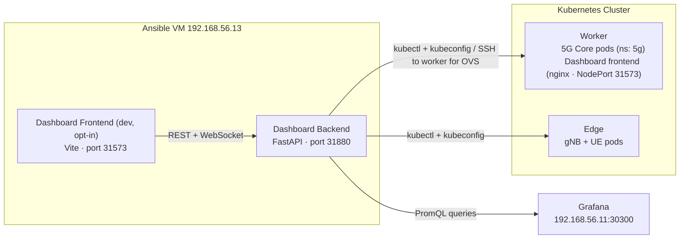
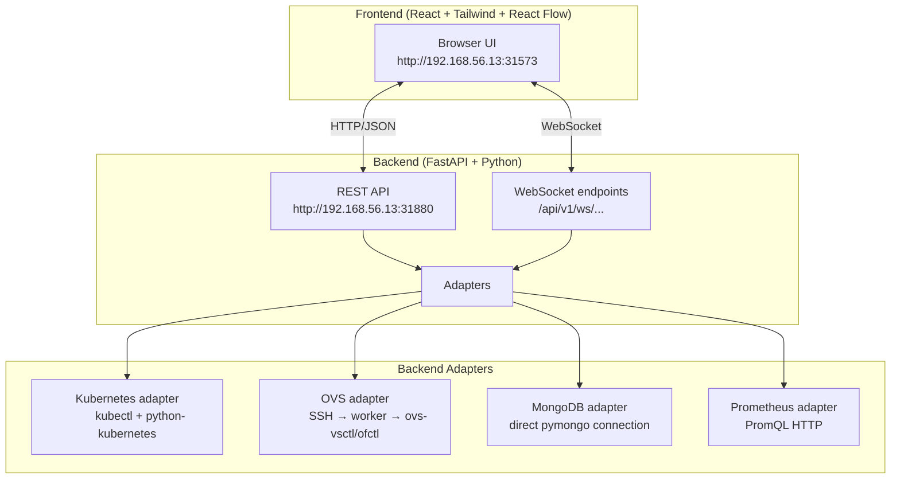

# Dashboard Overview

The testbed includes an out-of-band control and observability dashboard — a web application that lets you inspect, manage, and diagnose the 5G environment without modifying the `5g` namespace workloads.

## Why Out-of-Band

The dashboard backend runs on the **ansible VM** (192.168.56.13), out-of-band from the Kubernetes workloads. The baseline frontend is a cluster pod on the worker (NodePort); an optional dev frontend runs on the ansible VM:



**Reasons for this design**:

- **Blast radius isolation**: a crash or misconfiguration in the dashboard cannot affect AMF, SMF, UPF, or any 5G runtime pod
- **No resource contention**: the dashboard does not consume memory or CPU from the worker node running the 5G core
- **Mirrors professional practice**: in real 5G deployments, the OAM (Operations, Administration, and Maintenance) plane is physically separated from the control and user planes
- **Out-of-band access**: the dashboard remains reachable even when the Kubernetes control plane is degraded, as long as the ansible VM is up

## Architecture



## Access

| Service | URL | Notes |
|---------|-----|-------|
| Dashboard UI (cluster baseline) | http://192.168.56.11:31573 | nginx pod on the worker, NodePort; always on |
| Dashboard UI (dev frontend) | http://192.168.56.13:31573 | Vite dev server on the ansible VM; opt-in (`dashboard_dev_enabled`) |
| Dashboard API | http://192.168.56.13:31880/docs | FastAPI on the ansible VM (Swagger at /docs) |

The cluster frontend is deployed automatically in **Phase 9** and starts after provisioning. See the [Phase 9 README](https://github.com/Jacobbista/5g-k3s-kubedge-testbed/blob/main/ansible/phases/09-dashboard/README.md) for the cluster-versus-dev frontend model.

## Security Model

Authentication uses the Keycloak realm from phase 08. The backend validates the `Authorization: Bearer <jwt>` header against the realm JWKS and reads `realm_access.roles`. Two roles gate access:

- `dashboard-viewer`: all `GET` endpoints and the log stream.
- `dashboard-admin`: everything viewer can do, plus writes, pod exec, sniffer, subscribers, NF rollout, and restart.

WebSocket upgrades carry the token as a `?access_token=<jwt>` query parameter. Enforcement is applied at router-include time in `dashboard/backend/app/main.py`.

Auth is controlled by the single switch `dashboard_auth_enabled`. While disabled (the default until the realm is wired into production, `skip_auth=true`), the backend runs a break-glass bypass that treats every request as a synthetic admin. The legacy `admin` router (emergency restart) stays gated by the `DASHBOARD_ADMIN_TOKEN` header, independent of Keycloak.

All mutating actions are audit-logged to `backend/logs/audit.log` in NDJSON format. OVS shell operations run through an allowlist (`ovs-vsctl list-br`, `ovs-vsctl list-ports <bridge>`, `ovs-ofctl dump-flows <bridge>`) with size-capped, time-bounded output.

Full role model, client list, and the per-route matrix: [security/iam.md](../security/iam.md).

## Deployment

### Automatic (Phase 9)

The dashboard is installed and started automatically by `vagrant up`. To re-deploy or reconcile:

```bash
vagrant ssh ansible
cd ~/ansible-ro
ansible-playbook phases/09-dashboard/playbook.yml
```

### Development mode (live reload)

```bash
ansible-playbook phases/09-dashboard/playbook.yml -e dashboard_mode=dev
```

In `dev` mode, services run from `/vagrant/dashboard` with backend auto-restart and frontend polling for changes. Useful when developing the dashboard itself.

### Runtime modes

| Mode | Source directory | Behaviour |
|------|-----------------|-----------|
| `prod` (default) | `/home/vagrant/dashboard-work` | Stable, built from source at deploy time |
| `dev` | `/vagrant/dashboard` | Live reload, source changes reflected immediately |

### Service management

```bash
vagrant ssh ansible
sudo systemctl status dashboard-backend dashboard-frontend
sudo systemctl restart dashboard-backend dashboard-frontend
sudo journalctl -u dashboard-backend -f   # live logs
```

### Resilience

- **Systemd `Restart=always`**: backend auto-restarts on crash (3-second delay)
- **Manual runs**: use `./run-backend-watch.sh` for a loop that restarts the process if it exits
- **Frontend**: displays "Backend unreachable — reconnecting…" banner when the backend is down; polls for recovery

## Backend Configuration

Copy `dashboard/backend/.env.example` to `dashboard/backend/.env`. The settings model lives in `dashboard/backend/app/config.py`; the values most often changed are:

- Cluster access: `kubeconfig_path`, `worker_ssh_host`
- Data sources: `prometheus_url`, `mongodb_url`
- Auth: `keycloak_url`, `keycloak_realm`, `skip_auth` (see [security/iam.md](../security/iam.md))
- Legacy emergency restart: `admin_token`
- `allow_configmap_write` (default `false`): set `true` to enable ConfigMap editing from the UI

## Modules

The dashboard has 10 modules, grouped into four areas:

| Area | Modules |
|------|---------|
| Cluster | [Overview](modules.md#overview), [Kubernetes](modules.md#kubernetes), [Metrics](modules.md#metrics) |
| 5G | [5G Core](modules.md#5g-core), [RAN](modules.md#ran), [Subscribers](modules.md#subscribers), [UE Monitor](modules.md#ue-monitor) |
| Network | [Topology](modules.md#topology), [Diagnostics](modules.md#diagnostics) |
| Access | [IAM](modules.md#iam) (admin only) |

See [Dashboard Modules](modules.md) for full details on each module.

## Related Documentation

- [Dashboard Modules](modules.md) — detailed feature description for each of the 10 modules
- [API Reference](api-reference.md) — full REST and WebSocket endpoint listing
- [RAN Modes](../deployment/ran-modes-dashboard.md) — how to switch between physical and simulated RAN
- [Deployment Phases](../deployment/phases.md#phase-9-dashboard-control-plane) — Phase 9 detail
