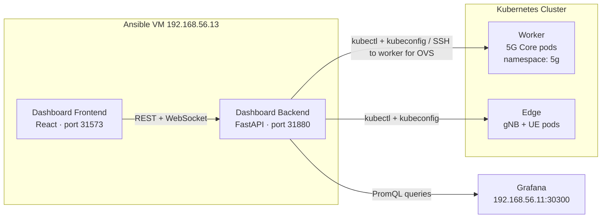
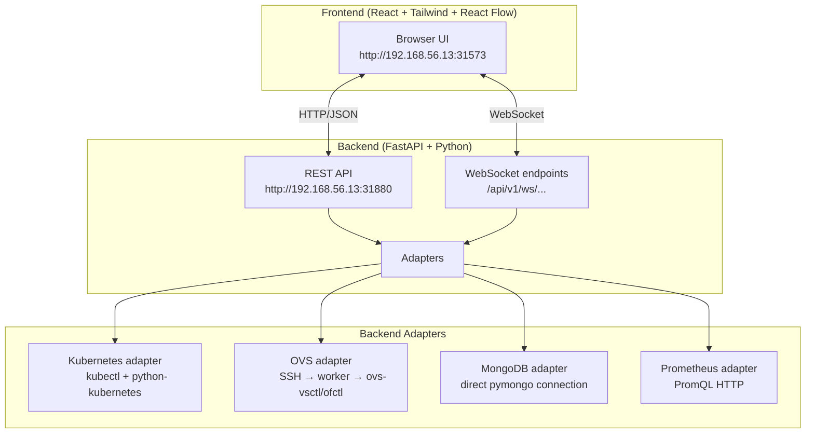

# Dashboard Overview

The testbed includes an out-of-band control and observability dashboard — a web application that lets you inspect, manage, and diagnose the 5G environment without modifying the `5g` namespace workloads.

## Why Out-of-Band

The dashboard runs on the **ansible VM** (192.168.56.13), not inside the Kubernetes cluster:



**Reasons for this design**:

- **Blast radius isolation**: a crash or misconfiguration in the dashboard cannot affect AMF, SMF, UPF, or any 5G runtime pod
- **No resource contention**: the dashboard does not consume memory or CPU from the worker node running the 5G core
- **Mirrors professional practice**: in real 5G deployments, the OAM (Operations, Administration, and Maintenance) plane is physically separated from the control and user planes
- **Out-of-band access**: the dashboard remains reachable even when the Kubernetes control plane is degraded, as long as the ansible VM is up

## Architecture



## Access

| Service | URL | Notes |
|---------|-----|-------|
| Dashboard UI | http://192.168.56.13:31573 | Web interface |
| Dashboard API | http://192.168.56.13:31880/docs | FastAPI interactive docs (Swagger) |

The dashboard is deployed automatically in **Phase 8** and starts immediately after provisioning. No additional setup is required to access it after `vagrant up`.

## Security Model

| Operation type | Auth required | Notes |
|---------------|--------------|-------|
| Read (pods, logs, topology, metrics) | No | Open by default |
| Write (restart deployments, edit ConfigMaps) | Bearer token | `Authorization: Bearer <DASHBOARD_ADMIN_TOKEN>` |
| OVS shell operations | Bearer token + allowlist | Only specific `ovs-vsctl` / `ovs-ofctl` commands permitted |

The admin token is set in `backend/.env` (`DASHBOARD_ADMIN_TOKEN`). All mutating actions are audit-logged to `backend/logs/audit.log` in NDJSON format.

**OVS operation allowlist** (shell commands that can be executed via the dashboard):
- `sudo ovs-vsctl list-br`
- `sudo ovs-vsctl list-ports <bridge>`
- `sudo ovs-ofctl dump-flows <bridge>`

Remote command output is size-capped and subject to a timeout.

## Deployment

### Automatic (Phase 8)

The dashboard is installed and started automatically by `vagrant up`. To re-deploy or reconcile:

```bash
vagrant ssh ansible
cd ~/ansible-ro
ansible-playbook phases/08-dashboard/playbook.yml
```

### Development mode (live reload)

```bash
ansible-playbook phases/08-dashboard/playbook.yml -e dashboard_mode=dev
```

In `dev` mode, services run from `/vagrant/dashboard` with backend auto-restart and frontend polling for changes. Useful when developing the dashboard itself.

### Runtime modes

| Mode | Source directory | Behaviour |
|------|-----------------|-----------|
| `prod` (default) | `/home/vagrant/dashboard-work` | Stable, built from source at deploy time |
| `dev` | `/vagrant/dashboard` | Live reload, source changes reflected immediately |

### Service management

```bash
vagrant ssh ansible
sudo systemctl status dashboard-backend dashboard-frontend
sudo systemctl restart dashboard-backend dashboard-frontend
sudo journalctl -u dashboard-backend -f   # live logs
```

### Resilience

- **Systemd `Restart=always`**: backend auto-restarts on crash (3-second delay)
- **Manual runs**: use `./run-backend-watch.sh` for a loop that restarts the process if it exits
- **Frontend**: displays "Backend unreachable — reconnecting…" banner when the backend is down; polls for recovery

## Backend Configuration

Copy `dashboard/backend/.env.example` to `dashboard/backend/.env` and set at minimum:

```env
DASHBOARD_KUBECONFIG_PATH=/home/vagrant/.kube/config
DASHBOARD_WORKER_SSH_HOST=worker
DASHBOARD_ADMIN_TOKEN=<strong-random-token>
DASHBOARD_ALLOW_CONFIGMAP_WRITE=false
```

`DASHBOARD_ALLOW_CONFIGMAP_WRITE` is `false` by default. Set to `true` to enable ConfigMap editing from the UI (requires admin token on all requests).

## Modules

The dashboard has 7 modules grouped into three areas:

| Area | Modules |
|------|---------|
| Cluster visibility | [Control Room](modules.md#module-1-control-room), [Topology Map](modules.md#module-2-topology-map), [Metrics](modules.md#module-5-metrics) |
| 5G-specific | [UE Monitoring](modules.md#module-4-ue-monitoring), [Subscriber Management](modules.md#module-3-subscriber-management) |
| Infrastructure control | [Physical RAN Config](modules.md#module-6-physical-ran-config), [Network Health](modules.md#module-7-network-health--traffic-observer) |

See [Dashboard Modules](modules.md) for full details on each module.

## Related Documentation

- [Dashboard Modules](modules.md) — detailed feature description for each of the 7 modules
- [API Reference](api-reference.md) — full REST and WebSocket endpoint listing
- [RAN Modes](../deployment/ran-modes-dashboard.md) — how to switch between physical and simulated RAN
- [Deployment Phases](../deployment/phases.md#phase-8-dashboard-control-plane) — Phase 8 detail
