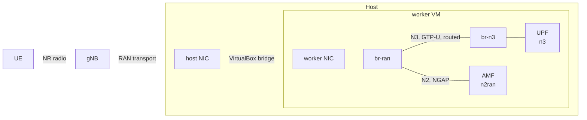
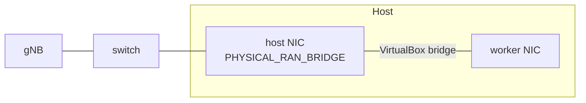

# Physical RAN Integration

A physical femtocell or small-cell gNB connects to the core through the worker
VM. This document describes how it is connected, how to attach and detach it,
how to configure the gNB, and how to check the result.

## How the gNB is connected



The gNB and the worker share one layer-2 segment, the RAN transport network,
whose subnet is `physical_ran_subnet` in `ansible/group_vars/all.yml`. A host NIC
on that segment is bridged into the worker VM, and the worker's NIC is a port of
the OVS bridge `br-ran`, which holds the gateway address `physical_ran_gateway`.

The AMF has an interface on `br-ran`, `n2ran`, with the address
`amf_physical_ran_ip`; the gNB's NGAP association terminates there. GTP-U from
the gNB goes to the UPF's N3 address through the gateway: the worker routes it
from `br-ran` to `br-n3`. The UPF sends the downlink back through the same route,
since its N3 attachment carries a route to `physical_ran_subnet` via the N3
gateway. No address is translated on this path, and `br-ran` has no layer-2
link to any plane bridge. The overlay addresses (the UPF's N3 address, the N2 and N3
gateways) are in [5G Interfaces](../architecture/5g-interfaces.md).

### Interfaces

| Layer | Setting | Where | Example | What it is |
|-------|---------|-------|---------|------------|
| Host interface | `PHYSICAL_RAN_BRIDGE` | Host | `enp2s0`, `enx<mac>` | The host NIC on the gNB's layer-2 network: a built-in port or a USB adapter. Vagrant bridges it into the worker VM |
| Worker interface | `physical_ran_interface` | Worker VM | `enp0s9` | The NIC VirtualBox creates in the worker. Left empty, it is found as the interface with an address in `physical_ran_subnet` |
| Bridge | `br-ran` | Worker VM (OVS) | `br-ran` | The OVS bridge the worker interface joins. It holds `physical_ran_gateway` |

Each time the worker starts (`vagrant up` or `reload`), the Vagrantfile writes the
host adapter it bridged to `.physical_ran_bridge_applied`. `kelt provision`
compares it with `PHYSICAL_RAN_BRIDGE` in `.testbed.env` and reloads the worker
when the two differ. The dashboard's RAN page shows the applied adapter in the
*Cable and link* details.

### Addresses on the RAN transport

| Component | Interface | Address | Variable |
|-----------|-----------|---------|----------|
| Worker | `br-ran` | `192.168.6.1/24` | `physical_ran_gateway` |
| AMF | `n2ran` | `192.168.6.150/24` | `amf_physical_ran_ip` |
| gNB | its RAN port | a free address, for example `192.168.6.100/24` | set on the gNB |

A gNB may also have a management port on a separate network of the operator.
KELT does not define that network.

### Who owns the RAN address

Vagrant gives the worker's RAN NIC the address `physical_ran_gateway`, and the
OVS setup uses it to find the NIC. Once the NIC is a port of `br-ran`, the address
is moved to the bridge: the same address left on the NIC makes the worker send
traffic (for example the GTP-U downlink) straight out of the NIC, around the
bridge. The OVS setup marks the NIC `Unmanaged` for systemd-networkd
(`/etc/systemd/network/05-kelt-ran-unmanaged.network`), so that networkd does not
restore the netplan address when it restarts, and then removes the address. After
a reboot the NIC is found again as the physical port of `br-ran`. `make ran`
checks that the address is on `br-ran` only.

### What runs where

| Component | Where | What it does |
|-----------|-------|--------------|
| OVS DaemonSet (`ds-net-setup-worker`) | Worker node (hostNetwork) | Runs `ovs-setup.sh`, which creates or removes `br-ran` and its gateway address. With `RAN_BRIDGE_MODE=disabled` it removes `br-ran` |
| NAD `n2-ran` | Kubernetes API | The NetworkAttachmentDefinition that attaches the AMF to `br-ran`. Detach deletes it (phase 4, tag `nad`) |
| Playbook guard | Ansible, phases 4 and 5 | With `physical_ran_enabled` true, checks that `br-ran` exists on the worker before creating `n2-ran` and attaching the AMF; if it is missing, the physical RAN resources are skipped for that run and the rest deploys. `physical_ran_skip_bridge_check: true` turns the check off |

---

## 1. Enable integration

### Select the host NIC

```bash
kelt ran <host_nic>     # `kelt ran disable` turns it off
```

The command writes `PHYSICAL_RAN_ENABLED=true` and `PHYSICAL_RAN_BRIDGE=<host_nic>`
to `.testbed.env`. `PHYSICAL_RAN_BRIDGE` gives the worker VM its RAN adapter (the
Vagrantfile adds it whenever the variable is set). `PHYSICAL_RAN_ENABLED` says
whether the core is attached to the RAN, which is what Attach and Detach change.

### Provision

```bash
kelt provision
```

When the bridge changed, the CLI first runs `vagrant reload worker`, and the
Vagrantfile bridges `PHYSICAL_RAN_BRIDGE` into the worker with the address
`physical_ran_gateway`. The playbook then creates `br-ran` (phase 4), and adds the `n2-ran` attachment to the AMF and the return route
to the UPF (phase 5).

### Attach and detach

On a running testbed whose worker has the RAN adapter, two pieces attach the core
to the RAN or detach it (see [contributing.md](../development/contributing.md#pieces)),
from the dashboard's RAN page or from the CLI:

```bash
kelt run-piece ran_attach   # PHYSICAL_RAN_ENABLED=true, then:
                            # phase 4 overlay → br-ran (setup pod) → nad → phase 5 nf_deployments → AMF on br-ran
kelt run-piece ran_detach   # PHYSICAL_RAN_ENABLED=false, then:
                            # phase 5 nf_deployments → phase 4 nad → overlay → br-ran removed
```

- **Attach** builds `br-ran` with the adapter, creates `n2-ran`, gives the
  UPF its route back to the RAN and the AMF its RAN interface, and restarts the
  AMF a second time only if its port is missing from `br-ran`. The UPF and the AMF
  restart, so every PDU session on every cell drops and is set up again. The gNB
  then sets up NGAP by itself.
- **Detach** removes the AMF's RAN interface, `n2-ran` and the UPF's route,
  then `br-ran`; the AMF and the UPF restart once. Every device on the gNB loses
  its link until Attach runs, and the dashboard asks for `detach` to be typed
  first. The worker keeps its RAN adapter, so Attach does not need a worker
  restart.
- Both restart the worker's network setup pod when `br-ran` has to change. That
  pod installs its tools from the Alpine package mirror when it starts, so the
  worker needs internet access for Attach and Detach to finish.
- Both change nothing when the RAN is already in that state, share one lock with
  `ran_link` (one RAN piece at a time), and are done only when the dashboard has
  read the state back from the running pods.

---

## 2. Configure the gNB

### Network

These are set in the gNB's own configuration, usually under LAN, Network or
Ethernet settings:

| Parameter | Value | Notes |
|-----------|-------|-------|
| gNB address | a free address in `physical_ran_subnet` | For example `192.168.6.100/24` |
| Default gateway | `physical_ran_gateway` (`192.168.6.1`) | Required: the UPF's N3 address is reached through it. Without it, GTP-U fails with `Network is unreachable` |
| Static routes, if the gNB has them | the N2 and N3 subnets via `physical_ran_gateway` | An alternative to the default gateway |

The gNB reaches the AMF on its own subnet, at `amf_physical_ran_ip`. The RAN page
of the dashboard shows these values for the running testbed, read from the
backend.

### 5G parameters

The PLMN and the slice are set in `ansible/phases/05-5g-core/configs/amf.yaml`:

| Parameter | Value |
|-----------|-------|
| MCC | `001` |
| MNC | `01` |
| TAC | `1` |
| AMF address | `amf_physical_ran_ip` (`192.168.6.150`) |
| AMF SCTP port | `38412` |
| S-NSSAI | SST 1, SD `000001` |

---

## 3. Physical connection

The gNB has to be on the same layer-2 segment as the host NIC named in
`PHYSICAL_RAN_BRIDGE`: connected to the same switch, or to the NIC directly.



The host NIC can be a built-in Ethernet port or a USB Ethernet adapter;
`kelt ran <host_nic>` takes its interface name as the host shows it.

---

## 4. Verify

### The RAN bridge

```bash
vagrant ssh worker
sudo ovs-vsctl show | grep -A6 br-ran
```

`br-ran` lists the worker NIC and the AMF's port, and nothing else:

```text
Bridge br-ran
    Port enp0s9
        Interface enp0s9
    Port veth...
        Interface veth...              # the AMF's n2ran
```

### Gateway addresses

```bash
ip -4 addr show br-ran | grep inet    # physical_ran_gateway
ip -4 addr show br-n3 | grep inet     # the N3 gateway only
```

### Reachability from the gNB

```bash
ping 192.168.6.1      # physical_ran_gateway, on br-ran
ping 192.168.6.150    # amf_physical_ran_ip, the AMF's n2ran
ping 10.203.0.101     # the UPF's N3 address, routed by the worker
```

### AMF and the gNB

```bash
sudo k3s kubectl logs -f -l app=amf -n 5g | grep -i gnb
```

A connected gNB shows as:

```text
[Added] Number of gNBs is now 1
```

### UPF return route

The UPF sends the GTP-U downlink to the gNB over N3. Without its return route it
uses its default route on N6, and the tunnel crosses `br-n6c` while traffic still
flows. The suite checks both the route and the wire:

```bash
cd tests && make ran    # "UPF Downlink Route via N3", "No GTP-U on N6 Bridges"
```

The UPF image has no `ip`; the network-setup init log shows the route:

```bash
sudo k3s kubectl logs -n 5g deploy/upf-cloud -c network-setup | grep "return route"
```

```text
[UPF][init] Adding return route for physical RAN subnet: 192.168.6.0/24
```

---

## 5. Simulated RAN (UERANSIM)

Detaching the physical RAN leaves the core without a RAN. The phase that installs
UERANSIM (`06-ueransim-mec`) is not maintained at the moment, and the dashboard
does not offer it.

---

## Troubleshooting

| Problem | Cause | Solution |
|---------|-------|----------|
| `ping 192.168.6.1` fails | `br-ran` has no address | Run `kelt run-piece ran_attach`; the address is set by the worker's network setup pod |
| `ping 10.203.0.101` fails from the gNB | The gNB has no route to the N3 subnet | Set the gNB's default gateway to `physical_ran_gateway`. A software gNB: `ip route add 10.203.0.0/16 via 192.168.6.1` |
| No GTP-U downlink to the gNB | The UPF has no return route | The route is part of the UPF's N3 attachment (`n3-upf-static`); the RAN page's *User plane* link reads it from the running UPF. `kelt run-piece ran_attach` puts it back |
| The AMF does not see the gNB | PLMN mismatch, or SCTP not loaded | Compare MCC, MNC and TAC with the table above; `sudo modprobe sctp` on the worker |
| `failed to find bridge br-ran` | The AMF's attachment refers to `br-ran`, which does not exist | The worker needs its RAN NIC and the overlay; restart `ds-net-setup-worker`. Same cause as a skipped physical RAN configuration (*What runs where*) |
| The physical RAN is skipped during deploy | `physical_ran_enabled` is true and `br-ran` is missing | Apply `PHYSICAL_RAN_BRIDGE` to the worker (`kelt provision` reloads it when needed, or `vagrant reload worker`), then run `kelt run-piece ran_attach` or Attach on the RAN page |
| `br-ran` or `n2-ran` still there after Detach | Detach did not finish | Run `kelt run-piece ran_detach` again; it restarts the setup pod while `br-ran` is still there |
| UE registered but no data | The PDU session fails at PFCP | Check the SMF to UPF N4 path and the UPF logs |

### Useful commands

```bash
# OVS bridges
sudo ovs-vsctl show

# Bridge addresses on the worker
ip -4 addr show | grep -E 'br-(ran|n2|n3)'

# The AMF's NGAP listener
sudo k3s kubectl exec -n 5g deploy/amf -- ss -Slnp | grep 38412

# GTP-U on br-n3
sudo tcpdump -i br-n3 udp port 2152 -c 10

# Subscriber IMSIs and slices, without the keys
sudo k3s kubectl exec -n 5g deploy/mongodb -- mongosh open5gs --quiet \
  --eval 'db.subscribers.find({}, {imsi: 1, "slice.sst": 1, _id: 0})'
```
