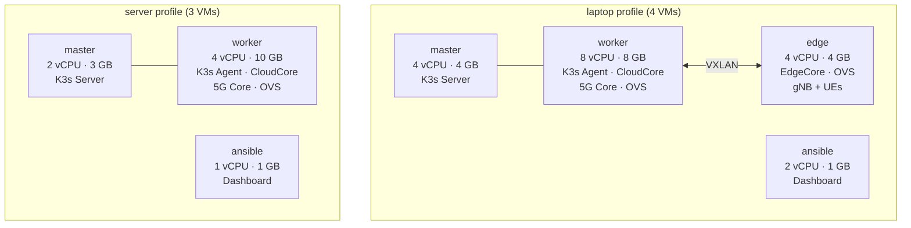
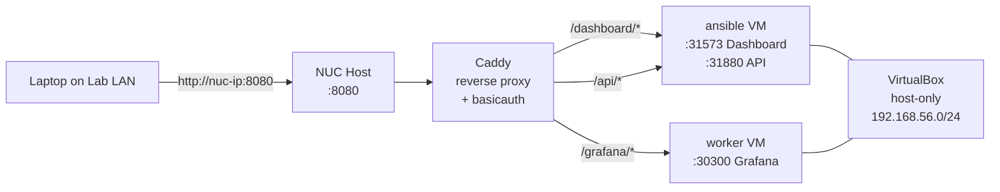
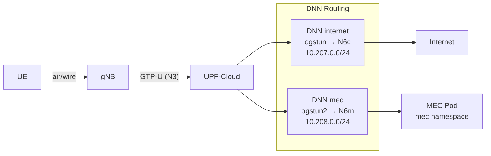

# Server / NUC Deployment

This guide covers deploying the testbed on a headless server or Intel NUC instead of a laptop. It uses the same Vagrant + Ansible pipeline as the [standard deployment](../getting-started.md), but with optimized resource profiles and fewer VMs.

> **Laptop users**: This guide is for server/NUC deployments. For laptop deployment, follow [Getting Started](../getting-started.md) — no profile configuration is needed, the default `laptop` profile creates all 4 VMs.

---

## Deployment Profiles

The testbed supports two deployment profiles that control how many VMs are created and how resources are allocated. Profiles are managed by [`testbed-config`](../tools/testbed-config.md).

| Profile | VMs | vCPU | RAM | Edge VM | Use case |
|---------|-----|------|-----|---------|----------|
| `laptop` | 4 (master, worker, edge, ansible) | 18 | 17 GB | Always | Development, UERANSIM simulation |
| `server` | 3 (master, worker, ansible) | 7 | 14 GB | No | Always-on lab, physical RAN |
| `server` + edge | 4 | 8 | 16 GB | On request | Server + KubeEdge experiments |



The server profile drops the edge VM and gives the worker more RAM (10 GB) to accommodate the full 5G core and MEC pods. The edge VM can be added back with `testbed-config edge on` when needed for KubeEdge experiments.

---

## Hardware Requirements

| Resource | Minimum | Recommended |
|----------|---------|-------------|
| CPU | 4 cores / 8 threads | 8+ threads |
| RAM | 16 GB | 32+ GB |
| Storage | 50 GB SSD | — |
| Network | 1x Ethernet (lab LAN) | 2nd NIC for [physical RAN](physical-ran.md) |
| BIOS | VT-x enabled | VT-x + VT-d |

Tested on: Intel NUC11TNHi5 (i5-1135G7, 4c/8t, 64 GB RAM).

---

## OS Setup

Install Ubuntu Server 22.04 LTS (minimal, no desktop), then VirtualBox and Vagrant:

```bash
# VirtualBox
sudo apt update
sudo apt install -y virtualbox virtualbox-ext-pack

# Vagrant
wget -O- https://apt.releases.hashicorp.com/gpg | sudo gpg --dearmor -o /usr/share/keyrings/hashicorp-archive-keyring.gpg
echo "deb [signed-by=/usr/share/keyrings/hashicorp-archive-keyring.gpg] https://apt.releases.hashicorp.com $(lsb_release -cs) main" \
  | sudo tee /etc/apt/sources.list.d/hashicorp.list
sudo apt update && sudo apt install -y vagrant
```

---

## Quick Start

```bash
git clone https://github.com/Jacobbista/5g-k3s-kubedge-testbed.git
cd 5g-k3s-kubedge-testbed

# 1. Set server profile (creates .testbed.env)
./testbed-config set-profile server

# 2. Create VMs
vagrant up

# 3. Run provisioning (K3s, KubeEdge CloudCore, OVS, Open5GS, Dashboard)
vagrant provision ansible
```

See [`testbed-config`](../tools/testbed-config.md) for the full CLI reference and interactive TUI mode.

---

## Edge VM (Optional)

The edge VM is disabled by default in the server profile. Enable it when you need KubeEdge experiments or UERANSIM simulation:

```bash
./testbed-config edge on
vagrant up        # creates the 4th VM
vagrant provision ansible
```

When edge is enabled:
- A 4th VM is created with 2 vCPU / 3 GB RAM
- Ansible inventory includes the `[edges]` group
- Phase 3 deploys KubeEdge EdgeCore
- Phase 4 creates VXLAN tunnels between worker and edge
- Phase 6 can deploy UERANSIM gNB + UEs on the edge node

When edge is disabled:
- Phases 3 (KubeEdge EdgeCore), and edge-specific tasks in phases 4-5 are skipped
- OVS bridges are created locally on worker without VXLAN tunnels
- Multus NADs still function for pods running on the worker

---

## Physical RAN

To bridge a physical gNB (femtocell) into the testbed overlay:

```bash
./testbed-config ran enp0s3   # replace with your NIC name
vagrant provision ansible
```

See [Physical RAN Integration](physical-ran.md) for the full guide including N3 routing and UPF return path configuration.

---

## Accessing Services from the Lab LAN

VMs run on a VirtualBox host-only network (`192.168.56.0/24`), which is not directly reachable from the lab LAN. A reverse proxy on the NUC host bridges the gap.



### Caddy Reverse Proxy (Recommended)

Install [Caddy](https://caddyserver.com/) on the NUC host (not inside VMs):

```bash
sudo apt install -y debian-keyring debian-archive-keyring apt-transport-https
curl -1sLf 'https://dl.cloudsmith.io/public/caddy/stable/gpg.key' \
  | sudo gpg --dearmor -o /usr/share/keyrings/caddy-stable-archive-keyring.gpg
curl -1sLf 'https://dl.cloudsmith.io/public/caddy/stable/debian.deb.txt' \
  | sudo tee /etc/apt/sources.list.d/caddy-stable.list
sudo apt update && sudo apt install caddy
```

Configure `/etc/caddy/Caddyfile`:

```
:8080 {
    # Dashboard UI — React frontend on ansible VM
    handle_path /dashboard/* {
        reverse_proxy 192.168.56.13:31573
    }
    # Dashboard API — FastAPI backend on ansible VM
    handle_path /api/* {
        reverse_proxy 192.168.56.13:31880
    }
    # Grafana — monitoring dashboards on worker VM
    handle_path /grafana/* {
        reverse_proxy 192.168.56.11:30300
    }
    # Require authentication for all paths
    basicauth * {
        admin <password-hash>
    }
}
```

Generate a password hash with `caddy hash-password`, then restart: `sudo systemctl restart caddy`.

Each `handle_path` block strips its prefix and forwards to the corresponding VM service. The `basicauth` block protects all paths with HTTP Basic Authentication — no service is exposed without credentials.

### SSH Tunnel (Quick Alternative)

For temporary access without installing a proxy:

```bash
# From your laptop — forwards 3 ports through SSH
ssh -L 31573:192.168.56.13:31573 \
    -L 31880:192.168.56.13:31880 \
    -L 30300:192.168.56.11:30300 \
    user@<nuc-ip>
```

Then access `http://localhost:31573` (Dashboard), `http://localhost:30300` (Grafana).

---

## MEC Services (N6m Data Path)

MEC application pods run on the worker node in the `mec` namespace. They are reachable by UEs through a dedicated data path that is separate from internet traffic:



The N6m network (`br-n6m`, VNI 108, subnet `10.208.0.0/24`) is created during Phase 4 provisioning. MEC pods attach to it via the `n6m-net` NetworkAttachmentDefinition in the `mec` namespace.

For the full interface specification (IPs, VXLAN key, validation commands), see the [N6m section in the Handbook](../operations/handbook.md#n6m--upf-cloud--mec-services).

---

## Security Notes

- **No direct port exposure**: All access from the lab LAN goes through the Caddy reverse proxy with authentication. No VM ports are forwarded to `0.0.0.0`.
- **MEC isolation**: MEC services are only reachable through the 5G data path (UE → UPF → N6m), not from the NUC host network.
- **VM isolation**: VMs are on the `192.168.56.0/24` host-only network, unreachable from the lab LAN without the proxy or SSH tunnel.
- **No credentials in config**: `testbed-config` stores only deployment flags in `.testbed.env` (gitignored), never secrets.

---

## Related Documentation

- [Getting Started](../getting-started.md) — standard laptop deployment
- [testbed-config](../tools/testbed-config.md) — full CLI and TUI reference
- [Deployment Phases](phases.md) — what each phase does, provisioning flags
- [Physical RAN Integration](physical-ran.md) — connecting a real femtocell
- [Handbook](../operations/handbook.md) — canonical IP reference and interface matrix
