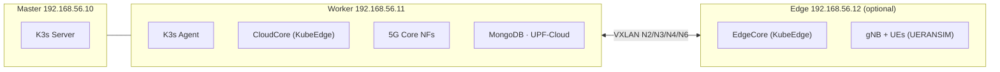

# Getting Started

This guide will get you from zero to a running 5G testbed in under 30 minutes.

## Prerequisites

- **VirtualBox** >= 6.1.0
- **Vagrant** >= 2.3.0
- **gum** (recommended) — interactive TUI for [`testbed-config`](tools/testbed-config.md)
- **Host resources**: 16 GB RAM, 4+ CPU cores recommended
- **OS**: Linux, macOS, or Windows with virtualization enabled

```bash
# VirtualBox
sudo apt install -y virtualbox virtualbox-ext-pack

# Vagrant
wget -O- https://apt.releases.hashicorp.com/gpg | sudo gpg --dearmor -o /usr/share/keyrings/hashicorp-archive-keyring.gpg
echo "deb [signed-by=/usr/share/keyrings/hashicorp-archive-keyring.gpg] https://apt.releases.hashicorp.com $(lsb_release -cs) main" \
  | sudo tee /etc/apt/sources.list.d/hashicorp.list
sudo apt update && sudo apt install -y vagrant

# gum — interactive TUI for testbed-config (recommended)
sudo mkdir -p /etc/apt/keyrings
curl -fsSL https://repo.charm.sh/apt/gpg.key | sudo gpg --dearmor -o /etc/apt/keyrings/charm.gpg
echo "deb [signed-by=/etc/apt/keyrings/charm.gpg] https://repo.charm.sh/apt/ * *" | sudo tee /etc/apt/sources.list.d/charm.list
sudo apt update && sudo apt install gum
```

For macOS/Windows install instructions, see [Requirements](requirements.md).

## Quick Start

```bash
git clone https://github.com/Jacobbista/5g-k3s-kubedge-testbed.git
cd 5g-k3s-kubedge-testbed

# Configure the testbed (profile, edge, RAN, deploy mode)
./testbed-config

# Deploy
vagrant up
```

[`testbed-config`](tools/testbed-config.md) opens an interactive menu (powered by gum) where you choose:

- **Deployment profile**: `laptop` (4 VMs, edge included) or `server` (3 VMs, no edge — for NUC/server)
- **Edge VM**: on/off — controls whether the edge node is created and KubeEdge EdgeCore is deployed
- **Deploy mode**: `core_only` (5G core + observability + dashboard) or `full` (also deploys UERANSIM on the edge)
- **Physical RAN**: bridge a host NIC for a real gNB

Configuration is saved to `.testbed.env` and picked up automatically by `vagrant up`. See [`testbed-config`](tools/testbed-config.md) for the full CLI reference.

> **Without gum**: the tool falls back to basic terminal prompts. You can also use it non-interactively: `./testbed-config set-profile server && ./testbed-config edge off`.

### Server / NUC Deployment

For headless servers or Intel NUCs, see [Server / NUC Deployment](deployment/server-setup.md) for hardware requirements, resource profiles, and remote access setup (reverse proxy).

## What Gets Deployed



> **Edge is optional.** In the `server` profile, only master, worker, and ansible VMs are created. The edge VM is added when enabled via `testbed-config edge on`. Without edge, phases 3 (EdgeCore) and 6 (UERANSIM) are skipped, and OVS bridges run locally on the worker without VXLAN tunnels.

Components deployed:
- K3s cluster (master + worker, optionally edge)
- KubeEdge (CloudCore on worker, EdgeCore on edge if enabled)
- OVS overlay networks (VXLAN tunnels when edge is present)
- Open5GS 5G Core (AMF, SMF, UPF, NRF, etc.)
- Observability stack (Prometheus, Loki, Grafana)
- Dashboard control plane (out-of-band on ansible VM)

## Verify Deployment

### Check Nodes

```bash
vagrant ssh master
sudo k3s kubectl get nodes
```

Expected output (with edge enabled):
```
NAME     STATUS   ROLES                  AGE   VERSION
master   Ready    control-plane,master   10m   v1.30.6+k3s1
worker   Ready    <none>                 8m    v1.30.6+k3s1
edge     Ready    agent,edge             6m    v1.30.6+k3s1
```

Without edge, only `master` and `worker` appear.

> **kubectl on K3s VMs**: K3s does not create a standalone `kubectl` binary — the cluster is managed via `sudo k3s kubectl`. All in-VM kubectl commands throughout these docs use this form.

### Check 5G Core

```bash
sudo k3s kubectl get pods -n 5g
```

All pods should be `Running`.

### Check UERANSIM (if edge is enabled and deploy mode is full)

```bash
sudo k3s kubectl get pods -n 5g -l app=gnb-1
sudo k3s kubectl get pods -n 5g -l app=ue
```

## Access the Cluster

### From Host Machine

```bash
# Copy kubeconfig
vagrant ssh master -c "cat /home/vagrant/kubeconfig" > kubeconfig
export KUBECONFIG=$(pwd)/kubeconfig
kubectl get nodes
```

### From Ansible VM

The ansible VM does not have `kubectl` installed. To run kubectl commands, SSH into master:

```bash
vagrant ssh master
sudo k3s kubectl get nodes
```

## Deploy UERANSIM Manually

UERANSIM (simulated RAN) is an optional addon, off by default and requiring the edge VM. To add it later:

```bash
testbed run-phase 06-ueransim-mec
```

See [Phase 6](deployment/phases.md#phase-6-ueransim) for details.

## Access the Dashboard

The dashboard is deployed automatically in Phase 9. Open it in your browser once provisioning completes:

| Service | URL |
|---------|-----|
| Dashboard UI (cluster baseline) | http://192.168.56.11:31573 |
| Dashboard UI (dev frontend, opt-in) | http://192.168.56.13:31573 |
| Dashboard API docs | http://192.168.56.13:31880/docs |
| Grafana | http://192.168.56.11:30300 (admin / admin5g) |

See [Dashboard Overview](dashboard/overview.md) for full documentation.

## Optional: 5G UE Probe (Physical UE Dongle)

If you have a physical 5G UE dongle (USB modem) and want to run experiments on your Linux host, use the `5g-probe` web app. It isolates the dongle into a Linux network namespace and lets you benchmark throughput and latency with a live chart UI.

```bash
cd 5g-probe
python3 -m venv venv && source venv/bin/activate
pip install -r requirements.txt
sudo $(which python3) app.py
# Open http://localhost:5000
```

See [docs/tools/5g-probe.md](tools/5g-probe.md) for the full guide including host requirements and API reference.

## Next Steps

- [Architecture Overview](architecture/overview.md) - Understand system design
- [Network Topology](architecture/network-topology.md) - Learn about 5G interfaces
- [Deployment Phases](deployment/phases.md) - Detailed phase documentation
- [Troubleshooting](operations/troubleshooting.md) - Common issues and solutions

## Cleanup

```bash
# Destroy all VMs
vagrant destroy -f

# Or just stop them
vagrant halt
```
