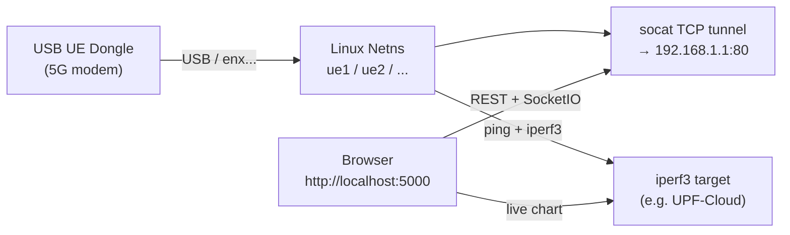
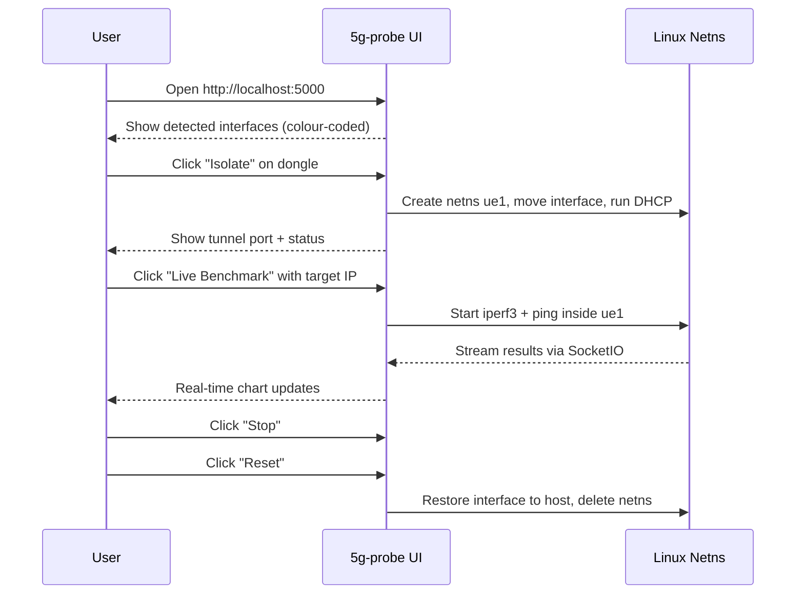

# 5G UE Probe

`5g-probe` is a host-side web application for managing and benchmarking physical 5G UE dongles (USB modems). It runs on your Linux laptop alongside Vagrant, not inside the Kubernetes cluster.

> **Predecessor note**: `ue_lab.py` in the project root is the original CLI predecessor of this tool. `5g-probe` replaces it with a full web interface, real-time benchmark streaming, and interface fingerprinting. `ue_lab.py` is kept for reference but is no longer the recommended approach.

## What It Does

When you connect a USB UE dongle (e.g. a 5G-capable modem) to your host machine, the device appears as a network interface (typically `enx...`). Without isolation, DHCP and routing from the dongle can interfere with your host network.

`5g-probe` solves this by:

1. **Isolating** the dongle into a Linux network namespace — the dongle's DHCP and routes are confined to the namespace
2. **Tunnelling** access to the dongle's web management UI (typically at 192.168.1.1:80) via a `socat` TCP tunnel
3. **Benchmarking** the connection with ping and iperf3, either as a blocking one-shot test or a live streaming benchmark



## Host Requirements

| Requirement | Notes |
|-------------|-------|
| Linux host | Tested on Ubuntu 22.04 |
| `iproute2` | For `ip netns`, `ip link` |
| `iperf3` | For throughput benchmarks |
| `isc-dhcp-client` or `dhclient` | For DHCP inside the namespace |
| `socat` | For the WebUI tunnel |
| Python 3.8+ | For the Flask app |
| `sudo` | Required for netns and interface operations |

Install dependencies on Ubuntu/Debian:
```bash
sudo apt install iproute2 iperf3 isc-dhcp-client socat python3 python3-pip
```

## Quick Start

```bash
cd 5g-probe
python3 -m venv venv && source venv/bin/activate
pip install -r requirements.txt
sudo $(which python3) app.py
```

Open **http://localhost:5000** in your browser.

> **Note**: `sudo` is required because network namespace and interface operations need root. The virtual environment path is passed explicitly so `sudo` uses the venv's Python.

## Features

### Interface Detection and Fingerprinting

On startup, `5g-probe` scans network interfaces and identifies:

- **Realtek (router/uplink) NICs**: typically used for tethering — should not be isolated
- **UE dongles**: identified by MAC OUI lookup — safe to isolate

The UI shows a colour-coded list so you select the right device.

### Namespace Isolation

Click **Isolate** on a detected dongle. `5g-probe`:

1. Creates a network namespace (`ue1`, `ue2`, ... auto-assigned)
2. Moves the dongle interface into the namespace
3. Runs DHCP inside the namespace to obtain the dongle's assigned IP
4. Sets up a `socat` listener to tunnel the dongle's management UI

The interface is completely isolated: its DHCP responses and routes cannot affect the host network stack.

### WebUI Tunnel

Once isolated, a port is exposed on localhost that tunnels to the dongle's web UI (192.168.1.1:80). You can manage the dongle (APN settings, SIM info, signal strength) through your browser without giving the dongle access to your host network.

### Benchmark: Quick Mode

A blocking one-shot test:
- **Ping**: 10 ICMP packets to a target IP, reports min/avg/max RTT
- **iperf3 downlink**: 10-second throughput test, reports Mbps
- **iperf3 uplink**: 10-second reverse test, reports Mbps

Results displayed immediately in the UI.

### Benchmark: Live Mode

A streaming benchmark with real-time charts:
- iperf3 runs in interval mode (1-second samples)
- ping runs in parallel
- Results streamed over SocketIO and rendered as animated Chart.js graphs (Ookla-style)
- Stop the test at any time; results are saved to `results/`

### Reset

Click **Reset** to move the dongle back to the host network stack and delete the namespace. All tunnels and processes in the namespace are terminated cleanly.

---

## API Reference

The Flask API is consumed by the browser UI but can also be called directly for scripting.

### REST

| Method | Path | Body | Description |
|--------|------|------|-------------|
| GET | `/api/status` | — | List interfaces and active namespaces |
| POST | `/api/isolate` | `{"interface": "enx..."}` | Isolate a NIC into an auto-named namespace |
| POST | `/api/reset` | `{"namespace": "ue1"}` | Remove namespace and restore NIC to host |
| POST | `/api/benchmark` | `{"namespace": "ue1", "target_ip": "..."}` | Run blocking ping + iperf3 |

### SocketIO Events

| Event | Direction | Payload | Description |
|-------|-----------|---------|-------------|
| `start_live_benchmark` | Client → Server | `{namespace, target_ip, duration, mode}` | Start live benchmark |
| `stop_live_benchmark` | Client → Server | — | Kill running test |
| `iperf_data` | Server → Client | `{mbps, second}` | One iperf3 interval result |
| `ping_data` | Server → Client | `{ms, seq}` | One ping reply |
| `benchmark_complete` | Server → Client | — | Test finished |

---

## Typical Workflow



---

## Target IP for Benchmarks

When running benchmarks from inside the namespace, use an IP that is reachable from the dongle:

- The dongle's PDU session IP (visible on dongle web UI or `ip addr` inside namespace)
- An iperf3 server running on the UPF side or on the internet

If you are testing against the testbed's UPF-Cloud, make sure the UPF N6c route covers your benchmark target IP.

---

## Related Documentation

- [Getting Started](../getting-started.md) — how to use 5g-probe in the context of the full testbed
- [Physical RAN Integration](../deployment/physical-ran.md) — connecting a physical gNB to the testbed
- [Requirements](../requirements.md) — full host-side software requirements
