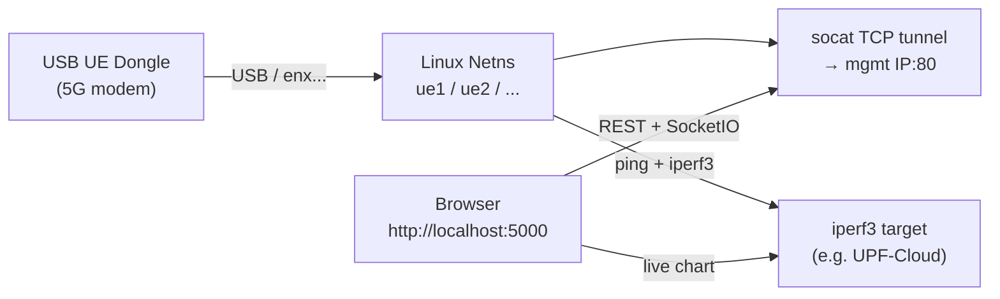
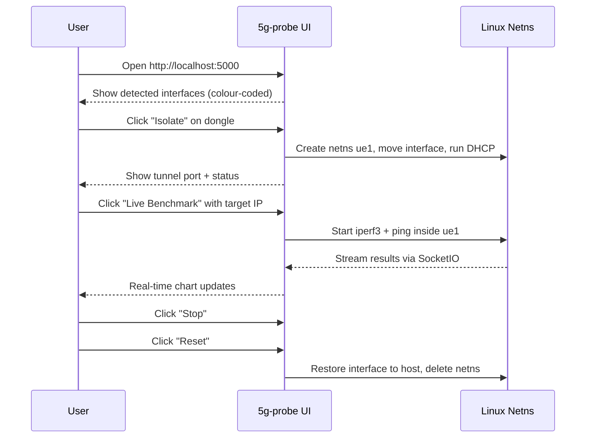

# 5G UE Probe

`5g-probe` is a host-side web application for managing and benchmarking physical 5G UE dongles (USB modems). It runs on your Linux laptop alongside Vagrant, not inside the Kubernetes cluster.

> **Predecessor note**: `ue_lab.py` in the project root is the original CLI predecessor of this tool. `5g-probe` replaces it with a full web interface, real-time benchmark streaming, and interface fingerprinting. `ue_lab.py` is kept for reference but is no longer the recommended approach.

## What It Does

When you connect a USB UE dongle (e.g. a 5G-capable modem) to your host machine, the device appears as a network interface (typically `enx...`). Without isolation, DHCP and routing from the dongle can interfere with your host network.

`5g-probe` solves this by:

1. **Isolating** the dongle into a Linux network namespace — the dongle's DHCP and routes are confined to the namespace
2. **Tunnelling** access to the dongle web management UI via a `socat` TCP tunnel (management IP and port are inferred from addressing when possible, or set in the isolate request)
3. **Benchmarking** the connection with ping and iperf3, either as a blocking one-shot test or a live streaming benchmark



## Host Requirements

| Requirement | Notes |
|-------------|-------|
| Linux host | Tested on Ubuntu 22.04 |
| `iproute2` | For `ip netns`, `ip link` |
| `iperf3` | For throughput benchmarks |
| `isc-dhcp-client` or `dhclient` | For DHCP inside the namespace |
| `socat` | For the WebUI tunnel |
| `bash` | Used by the tunnel relay (`bash -c …`; typically `/bin/bash` already present) |
| Desktop terminal (optional) | `gnome-terminal`, `konsole`, `xfce4-terminal`, or `x-terminal-emulator` for **Open terminal** in the UI when using `sudo` with a graphical session |
| Python 3.8+ | For the Flask app |
| `sudo` | Required for netns and interface operations |

Install dependencies on Ubuntu/Debian:
```bash
sudo apt install iproute2 iperf3 isc-dhcp-client socat python3 python3-pip
```

## Quick Start

```bash
cd 5g-probe
python3 -m venv venv
./venv/bin/pip install -r requirements.txt
./run-probe.sh
```

Open **http://localhost:5000** in your browser.

`sudo` resets `PATH`, so an activated venv is ignored. **`./run-probe.sh`** invokes `sudo /full/path/to/venv/bin/python -m probe`. The same effect manually: `sudo ./venv/bin/python -m probe`.

The Flask app lives in the **`probe/`** Python package (`python -m probe`); there is no top-level `app.py`.

## Features

### Interface Detection and Fingerprinting

On startup, `5g-probe` scans network interfaces and identifies:

- **Realtek (router/uplink) NICs**: typically used for tethering — should not be isolated
- **UE dongles**: identified by MAC OUI lookup — safe to isolate

The UI shows a colour-coded list so the correct device can be selected.

### Network diagnostics

`GET /api/status` enriches each host interface and each active namespace with IPv4 address, subnet, default gateway, link MTU, a coarse `topology_hint` (`dongle_lan`, `wwan_pdu`, `tether`, `unknown`), and ordered `management_candidates` for the Web UI. Namespace rows use `DEFAULT_ROUTE_PROBE` for `ip route get` inside the netns when computing route MTU hints; it defaults to **`FIVEG_PROBE_UPF_TARGET`** (`10.45.0.1` unless overridden). Override the probe address alone with **`FIVEG_PROBE_ROUTE_PROBE`** if needed.

**Preset benchmark IPs** are optional datalist shortcuts only (`benchmark_targets` on **`GET /api/config`**). **UPF-Cloud** maps to **`FIVEG_PROBE_UPF_TARGET`** (default `10.45.0.1`). **MEC iperf** (post-UPF decapsulated path) appears when **`FIVEG_PROBE_MEC_IPERF_TARGET`** is set. You can always type another IP for ping/iperf and for each queued plan run—runs toward different endpoints are independent.

### Namespace Isolation

Click **Isolate** on a detected dongle. `5g-probe`:

1. Creates a network namespace (`ue1`, `ue2`, ... auto-assigned)
2. Moves the dongle interface into the namespace
3. Runs DHCP inside the namespace to obtain the dongle's assigned IP
4. Starts a **small HTTP proxy** on localhost that forwards into the namespace toward the modem management IP/port (still uses **`socat`** only for the upstream TCP leg inside the netns).

The interface is completely isolated: its DHCP responses and routes cannot affect the host network stack.

### WebUI Tunnel

Once isolated, **`http://127.0.0.1:<port>`** is served by an in-process proxy (Flask thread). It **rewrites the HTTP `Host` header** to the modem IP (and port if not 80); browsers send `Host: 127.0.0.1:<tunnel>`, which many dongles reject with an empty TCP close — that looked like **ERR_EMPTY_RESPONSE** even when a direct GET from inside the netns succeeded. Defaults follow discovery; optional JSON fields `management_host` and `management_port` on `POST /api/isolate` override them.

If the browser still errors, causes include **HTTPS-only** UI (needs TLS termination, not handled here), wrong **management_port**, or the proxy failing to bind the port. **`use_reloader=False`** avoids Flask dropping tunnel threads. Isolate logs and **`GET /api/status`** use **`management_http_ok`** from a **browser-like GET through the localhost tunnel** (not only a direct netns probe).

### Shell in namespace

`POST /api/open_netns_terminal` with `{"namespace":"ue1"}` tries to spawn a graphical terminal as **SUDO_USER** (`runuser`) with `DISPLAY`, `WAYLAND_DISPLAY`, `XAUTHORITY`, and D-Bus vars merged from the root process environment **and** from `/run/user/<SUDO_UID>/environ` when missing (sudo strips GUI vars unless preserved). **`./run-probe.sh`** passes `sudo --preserve-env=DISPLAY,WAYLAND_DISPLAY,...` so a normal desktop session usually works. Several emulators are tried (GNOME Terminal, **kgx**/ptyxis, Konsole, Tilix, Kitty, …). On failure the JSON includes **`error`**, optional **`hint`**, and **`command`** (`sudo ip netns exec … bash`) — use **Copy shell** if nothing opens.

### Plan templates vs run outputs

- **Templates** (what **Save template** writes): only the experiment list in `plan_templates/<slug>/plan.json` (no namespace or target stored on the template). Repo built-ins live under **`plan_templates/defaults/`** (e.g. `defaults/standard_iperf_smoke/plan.json`). On first start, **`standard_iperf_smoke_my`** is seeded under **`defaults/`** if missing.
- **Runs** (each execution): `results/plan_runs/<slug>/run_<timestamp>/` with `run.json` (includes `namespace` and `target_ip` for that run), plus per-experiment CSV folders, etc.

If an older tree still has **`results/plans/`**, the app migrates once: template JSON → `plan_templates`, run directories → `results/plan_runs/`, and rewrites stored `plans/…` paths to `plan_runs/…`. Both built-ins are **read-only** in the Templates tab: **Duplicate**, then save under a new title. User-created templates show **Edit** and **Delete**.

### Benchmark: Quick Mode

A blocking one-shot test:
- **Ping**: 10 ICMP packets to a target IP, reports min/avg/max RTT
- **iperf3 downlink**: 5-second throughput test, reports Mbps
- **iperf3 uplink**: 5-second reverse test, reports Mbps

Optional JSON field `parallel_streams` maps to iperf3 `-P`. Results appear immediately in the UI.

### Benchmark: Live Mode

A streaming benchmark with real-time charts:
- iperf3 runs with configurable `-i` interval (default 0.1s) and optional `-P` parallel streams
- UDP supports separate uplink and downlink bitrate targets when direction is **Sequential (DL → UL)**
- UDP payload sizing: **fixed** (`-l`), **omit** (iperf3 default), or **auto** (from route or link MTU with a configurable clamp)
- ping runs in parallel for bufferbloat mode
- Results stream over SocketIO to Chart.js; stopping the test is supported; exports land under `results/`

Experiment planner templates may set `parallel_streams`, `interval_s`, `bandwidth_dl`, `udp_length_mode`, and `udp_mtu_clamp` per experiment.

### Reset

Click **Reset** to move the dongle back to the host network stack and delete the namespace. All tunnels and processes in the namespace are terminated cleanly.

---

## API Reference

The Flask API is consumed by the browser UI but can also be called directly for scripting.

### REST

| Method | Path | Body | Description |
|--------|------|------|-------------|
| GET | `/api/config` | — | Default `target_ip` plus `benchmark_targets` (named presets for UI datalist only; pass any `target_ip` on benchmark APIs) |
| GET | `/api/status` | — | Host interfaces and namespaces (`interface_details`, `webui_tunnel_listening`, `management_tcp_ok`, `webui_tunnel_hint`, …) |
| POST | `/api/isolate` | `{"interface": "enx...", "management_host"?, "management_port"?}` | Isolate a NIC; optional management override for the socat tunnel |
| POST | `/api/reset` | `{"namespace": "ue1"}` | Remove namespace and restore NIC to host |
| POST | `/api/benchmark` | `{"namespace", "target_ip", "parallel_streams"?}` | Blocking ping + iperf3 DL/UL |
| POST | `/api/open_netns_terminal` | `{"namespace": "ue1"}` | Open a GUI terminal with `ip netns exec … bash` when possible |

### SocketIO Events

| Event | Direction | Payload | Description |
|-------|-----------|---------|-------------|
| `start_live_benchmark` | Client → Server | See UI; includes `parallel_streams`, `interval_s`, `bandwidth_dl`, `udp_length_mode`, `udp_mtu_clamp`, `length_bytes`, `with_ping` | Start live benchmark |
| `stop_live_test` | Client → Server | — | Stop live iperf or ping |
| `iperf_data` | Server → Client | `{mbps, second, …}` | One iperf3 interval sample |
| `ping_data` | Server → Client | `{ms, seq}` | One ping reply |
| `test_complete` | Server → Client | `{status, phases?, …}` | Benchmark or ping finished |

---

## Typical Workflow



---

## Target IP for Benchmarks

When running benchmarks from inside the namespace, use an IP that is reachable from the dongle—there is no single “correct” endpoint:

- **UPF / tunnel anchor** (`10.45.0.1` by default): PDU path toward UPF-Cloud; useful as one datapoint. **`FIVEG_PROBE_UPF_TARGET`** if yours differs.
- **Post-UPF / MEC iperf**: optional preset when **`FIVEG_PROBE_MEC_IPERF_TARGET`** is set—another datapoint on decapsulated user-plane traffic.
- **Any other IP**: lab servers, internet hosts, alternate slices—type freely in the UI or JSON bodies; rerun toward another IP anytime.

If you hit UPF-Cloud first then MEC later (or vice versa), those are separate measurements, not competing modes.

If you are testing against the testbed's UPF-Cloud, ensure the UPF N6c route covers your benchmark target IP for paths beyond the anchor.

---

## Related Documentation

- [Getting Started](../getting-started.md) — how to use 5g-probe in the context of the full testbed
- [Physical RAN Integration](../deployment/physical-ran.md) — connecting a physical gNB to the testbed
- [Requirements](../requirements.md) — full host-side software requirements
