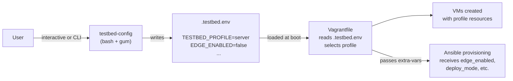
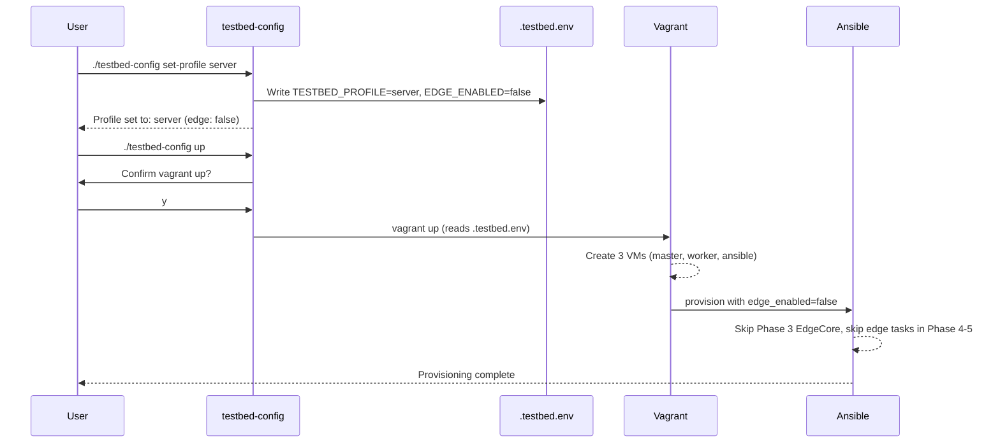

# testbed-config

`testbed-config` is an interactive CLI tool for configuring the testbed before deployment. It manages deployment profiles, edge VM toggle, physical RAN bridge selection, and other parameters — persisting them to `.testbed.env` so that `vagrant up` and Ansible provisioning pick them up automatically.

> **Optional dependency**: Install [gum](https://github.com/charmbracelet/gum) (Charm) for a polished TUI experience with styled menus and confirmations. Without gum, the tool falls back to basic `select`/`read` prompts.

## What It Does



The tool writes configuration to `.testbed.env` (gitignored). The Vagrantfile reads this file at startup to determine which VMs to create and how to allocate resources. Environment variables set in the shell take precedence over `.testbed.env` values.

## Requirements

| Requirement | Notes |
|-------------|-------|
| bash | 4.0+ (uses `set -euo pipefail`) |
| gum (optional) | For interactive TUI menus. Fallback: basic terminal prompts |

### Install gum (Ubuntu/Debian)

```bash
sudo mkdir -p /etc/apt/keyrings
curl -fsSL https://repo.charm.sh/apt/gpg.key | sudo gpg --dearmor -o /etc/apt/keyrings/charm.gpg
echo "deb [signed-by=/etc/apt/keyrings/charm.gpg] https://repo.charm.sh/apt/ * *" \
  | sudo tee /etc/apt/sources.list.d/charm.list
sudo apt update && sudo apt install gum
```

## Quick Start

### Interactive Mode

```bash
./testbed-config
```

Launches a TUI menu (with gum) or a numbered menu (without gum):

```
  ╭──────────────────────────────────╮
  │  5G K3s KubeEdge Testbed         │
  │  ────────────────────────────    │
  │  Hardware:  8 threads, 64 GB RAM │
  │  Profile:   server               │
  │  Edge VM:   disabled             │
  │  Deploy:    core_only            │
  │  RAN:       disabled             │
  │  Dashboard: prod                 │
  ╰──────────────────────────────────╯

  > Set deployment profile
    Toggle edge VM
    Configure physical RAN
    Set deploy mode (core_only/full)
    Start cluster (vagrant up)
    Run provisioning
    Show full status
    Exit
```

### Non-Interactive Mode

```bash
./testbed-config set-profile server
./testbed-config edge on
./testbed-config up
```

---

## CLI Reference

| Command | Arguments | Description |
|---------|-----------|-------------|
| *(none)* | — | Launch interactive TUI menu |
| `show` | — | Display current configuration |
| `set-profile` | `laptop` \| `server` | Set deployment profile. Server disables edge by default |
| `edge` | `on` \| `off` | Enable or disable the edge VM |
| `ran` | `<nic>` \| `disable` | Set physical RAN bridge interface, or disable |
| `up` | — | Run `vagrant up` with current configuration (confirms first) |
| `provision` | — | Run `vagrant provision ansible` (confirms first) |
| `env` | — | Print `export` commands for current config (for `eval`) |
| `help` | — | Show usage and command list |

---

## Features

### Hardware Detection

On startup, the tool detects CPU thread count and RAM. When selecting a profile interactively, it suggests `server` for machines with 8 or fewer threads and `laptop` for machines with more.

### Profile Selection

Two profiles are available:

| Profile | VMs | vCPU total | RAM total | Edge |
|---------|-----|------------|-----------|------|
| `laptop` | 4 (master, worker, edge, ansible) | 18 | 17 GB | Always |
| `server` | 3 (master, worker, ansible) | 7 | 14 GB | Off by default |

Setting `server` automatically disables edge. Setting `laptop` automatically enables it. You can override edge independently with `edge on/off` after setting the profile.

### Edge Toggle

`edge on` adds the edge VM to the deployment. This changes the active profile from `server` to `server_edge` internally (different resource allocation). In interactive mode, enabling edge also asks whether to deploy UERANSIM (`full` mode). `edge off` removes the edge VM and automatically sets deploy mode to `core_only` — UERANSIM requires the edge node.

### Physical RAN Bridge

`ran <nic>` selects a host NIC to bridge into the testbed for physical gNB connectivity. In interactive mode, available NICs are listed for selection. `ran disable` turns it off.

---

## Configuration File

The tool persists all settings to `.testbed.env` in the project root:

```bash
# Generated by testbed-config — do not edit manually
TESTBED_PROFILE=server
EDGE_ENABLED=false
DEPLOY_MODE=core_only
PHYSICAL_RAN_ENABLED=false
PHYSICAL_RAN_BRIDGE=
DASHBOARD_MODE=prod
```

### Precedence

Configuration values are resolved in this order (highest priority first):

1. **Shell environment variables** — `TESTBED_PROFILE=laptop vagrant up`
2. **`.testbed.env`** — written by `testbed-config`
3. **Defaults** — `laptop` profile, edge enabled, `core_only` deploy mode

---

## Typical Workflow



---

## Related Documentation

- [Server / NUC Deployment](../deployment/server-setup.md) — full server deployment guide using testbed-config
- [Getting Started](../getting-started.md) — standard laptop deployment
- [Deployment Phases](../deployment/phases.md) — what each phase does and how flags affect them
