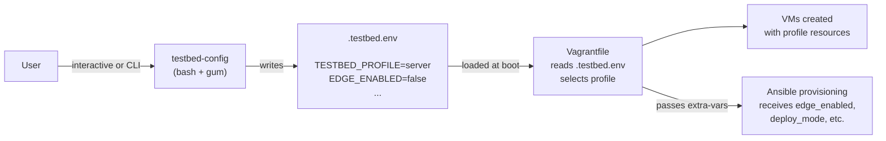
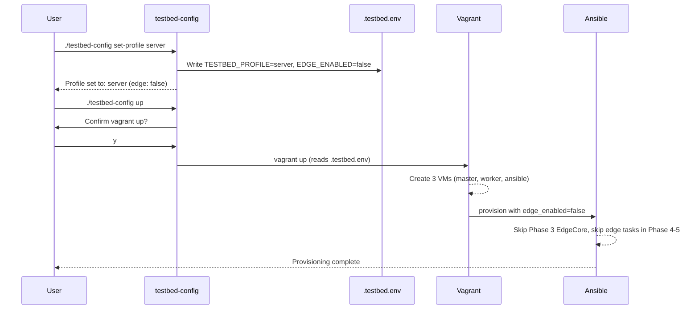

# testbed-config

`testbed-config` is an interactive CLI tool for configuring the testbed before deployment. It manages deployment profiles, edge VM toggle, physical RAN bridge selection, IAM/CAMARA secret material, and other parameters, persisting non-secret values to `.testbed.env` and secrets to `.testbed.secrets`.

It carries two interfaces over one implementation: an interactive TUI, which is the intended way to operate the testbed, and positional subcommands for direct terminal control, CI, and agents. Every menu action has a matching subcommand. See [Two interfaces](https://github.com/Jacobbista/kelt/blob/main/QUICKSTART.md#two-interfaces-one-behavior), which owns that model and the subcommand reference.

> **Optional dependency**: Install [gum](https://github.com/charmbracelet/gum) (Charm) for a polished TUI experience with styled menus and confirmations. Without gum, the tool falls back to basic `select`/`read` prompts.

## What It Does



The tool writes non-secret configuration to `.testbed.env` and writes IAM bootstrap secret material to `.testbed.secrets` (both gitignored). The Vagrantfile reads both files at startup to determine which VMs to create and how to allocate resources. Environment variables set in the shell take precedence over file values.

## Requirements

| Requirement | Notes |
|-------------|-------|
| bash | 4.0+ (uses `set -euo pipefail`) |
| gum (optional) | For interactive TUI menus. Fallback: basic terminal prompts |

### Install gum (Ubuntu/Debian)

```bash
sudo mkdir -p /etc/apt/keyrings
curl -fsSL https://repo.charm.sh/apt/gpg.key | sudo gpg --dearmor -o /etc/apt/keyrings/charm.gpg
echo "deb [signed-by=/etc/apt/keyrings/charm.gpg] https://repo.charm.sh/apt/ * *" \
  | sudo tee /etc/apt/sources.list.d/charm.list
sudo apt update && sudo apt install gum
```

## Quick Start

### Interactive Mode

```bash
./testbed-config
```

Launches a TUI menu (with gum) or a numbered menu (without gum):

```
  ╭──────────────────────────────────╮
  │  5G K3s KubeEdge Testbed         │
  │  ────────────────────────────    │
  │  Hardware:  8 threads, 64 GB RAM │
  │  Profile:   server               │
  │  Edge VM:   disabled             │
  │  Deploy:    core_only            │
  │  RAN:       disabled             │
  │  Dev front: false                │
  ╰──────────────────────────────────╯

  > Set deployment profile
    Toggle edge VM
    Configure physical RAN
    Set deploy mode (core_only/full)
    Start cluster (vagrant up)
    Run provisioning
    Show full status
    Exit
```

### Non-Interactive Mode

```bash
./testbed-config set-profile server
./testbed-config edge on
./testbed-config up
```

---

## CLI Reference

| Command | Arguments | Description |
|---------|-----------|-------------|
| *(none)* | — | Launch interactive TUI menu |
| `show` | — | Display current configuration |
| `set-profile` | `laptop` \| `server` | Set deployment profile. Server disables edge by default |
| `edge` | `on` \| `off` | Enable or disable the edge VM |
| `ran` | `<nic>` \| `disable` | Set physical RAN bridge interface, or disable |
| `auth-network` | `status` \| `dev` \| `auth` \| `origin` \| `positioning-origin` \| `prefix` \| `keycloak-url` \| `preset-cloudflare` | Configure auth/domain/path non-secret values. With gum and no args, opens a guided wizard. |
| `dashboard-dev` | `true` \| `false` | Toggle the opt-in Vite dev frontend on the ansible VM, persisted as `DASHBOARD_DEV_ENABLED` in `.testbed.env`. The cluster pod is the always-on baseline. |
| `dashboard-auth` | `enabled` \| `disabled` | Set `DASHBOARD_AUTH_ENABLED` persisted in `.testbed.env`. |
| `iam-admin-password` | `[password]` \| `--clear` | Set or clear Keycloak admin bootstrap password stored in `.testbed.secrets`. With gum and no args, opens a guided chooser (`auto-generate`, `manual`, `clear`). |
| `secrets` | `generate-missing` \| `manual` \| `rotate` \| `status` \| `clear` | Manage IAM/CAMARA secrets in `.testbed.secrets`. With gum and no args, opens a guided wizard. |
| `run-phase` | `[phase-dir] [tags] [key=value ...]` | Run a single phase playbook (`phases/<phase-dir>/playbook.yml`) via the ansible VM. Automatically loads `/vagrant/.testbed.env` and `/vagrant/.testbed.secrets` before execution. Extra positional arguments select tags and set extra vars. |
| `up` | — | Run `vagrant up` with current configuration (confirms first) |
| `provision` | — | Run `vagrant provision ansible` (confirms first) |
| `env` | — | Print `export` commands for current config (for `eval`) |
| `help` | — | Show usage and command list |

---

## Features

### Hardware Detection

On startup, the tool detects CPU thread count and RAM. When selecting a profile interactively, it suggests `server` for machines with 8 or fewer threads and `laptop` for machines with more.

### Profile Selection

Two profiles are available:

| Profile | VMs | vCPU total | RAM total | Edge |
|---------|-----|------------|-----------|------|
| `laptop` | 4 (master, worker, edge, ansible) | 18 | 17 GB | Always |
| `server` | 3 (master, worker, ansible) | 7 | 14 GB | Off by default |

Setting `server` automatically disables edge. Setting `laptop` automatically enables it. You can override edge independently with `edge on/off` after setting the profile.

### Edge Toggle

`edge on` adds the edge VM to the deployment. This changes the active profile from `server` to `server_edge` internally (different resource allocation). In interactive mode, enabling edge also asks whether to deploy UERANSIM (`full` mode). `edge off` removes the edge VM and automatically sets deploy mode to `core_only`. UERANSIM requires the edge node.

### Physical RAN Bridge

`ran <nic>` selects a host NIC to bridge into the testbed for physical gNB connectivity. In interactive mode, available NICs are listed for selection. `ran disable` turns it off.

When `PHYSICAL_RAN_ENABLED=true` and `PHYSICAL_RAN_BRIDGE` differs from the NIC currently applied to the worker VM, `testbed-config provision` reloads the worker before running Ansible so the bridged adapter is actually attached.

### IAM/CAMARA Secrets

`iam-admin-password` sets only `KEYCLOAK_ADMIN_PASSWORD`. The `secrets` command manages all secret keys used by phase 08 and phase 10:

- `KEYCLOAK_ADMIN_PASSWORD`
- `CAMARA_CLIENT_SECRET`
- `DASHBOARD_READONLY_SECRET`

In gum mode, `./testbed-config secrets` opens a guided wizard. During `testbed-config provision`, if one or more secrets are missing, the tool asks whether to auto-generate missing values, open the wizard, or abort.

### Auth/Network Non-Secret Settings

`auth-network` manages non-secret values in `.testbed.env` that control public auth routing and URL alignment:

- `DASHBOARD_DEV_ENABLED`
- `DASHBOARD_AUTH_ENABLED`
- `KEYCLOAK_PATH_PREFIX`
- `DASHBOARD_KEYCLOAK_EXTERNAL_URL`
- `DASHBOARD_KEYCLOAK_PATH_PREFIX`
- `DASHBOARD_EXTERNAL_ORIGIN`
- `POSITIONING_DEMO_EXTERNAL_ORIGIN`

The `preset-cloudflare` action asks for a public domain and applies a single-origin profile (`https://<domain>`, `/auth`, auth enabled). The dev frontend toggle is orthogonal to this preset and stays under explicit operator control.

The dashboard frontend has two targets, controlled independently:

- `dashboard_cluster_enabled` (default `true`) keeps the prebuilt nginx pod on the worker as the baseline production frontend.
- `dashboard_dev_enabled` (default `false`) provisions an optional Vite dev server on the ansible VM with hot reload. Toggleable from the prod UI sidebar (`DevModeIndicator`) once the phase has run at least once.

---

## Configuration File

The tool persists non-secret settings to `.testbed.env` in the project root:

```bash
# Generated by testbed-config — do not edit manually
TESTBED_PROFILE=server
EDGE_ENABLED=false
DEPLOY_MODE=core_only
PHYSICAL_RAN_ENABLED=false
PHYSICAL_RAN_BRIDGE=
DASHBOARD_DEV_ENABLED=false
DASHBOARD_AUTH_ENABLED=true
KEYCLOAK_PATH_PREFIX=
DASHBOARD_KEYCLOAK_EXTERNAL_URL=
DASHBOARD_KEYCLOAK_PATH_PREFIX=
DASHBOARD_EXTERNAL_ORIGIN=
POSITIONING_DEMO_EXTERNAL_ORIGIN=
```

Secret values are stored separately in `.testbed.secrets`:

```bash
# Generated by testbed-config — secrets
KEYCLOAK_ADMIN_PASSWORD=<generated-or-user-supplied>
CAMARA_CLIENT_SECRET=<generated-or-user-supplied>
DASHBOARD_READONLY_SECRET=<generated-or-user-supplied>
```

### Precedence

Configuration values are resolved in this order (highest priority first):

1. **Shell environment variables**: `TESTBED_PROFILE=laptop vagrant up`
2. **`.testbed.env`**: written by `testbed-config`
3. **Defaults**: `laptop` profile, edge enabled, `core_only` deploy mode

---

## Typical Workflow



---

## Related Documentation

- [Server / NUC Deployment](../deployment/server-setup.md): full server deployment guide using testbed-config
- [Getting Started](../getting-started.md): standard laptop deployment
- [Deployment Phases](../deployment/phases.md): what each phase does and how flags affect them
